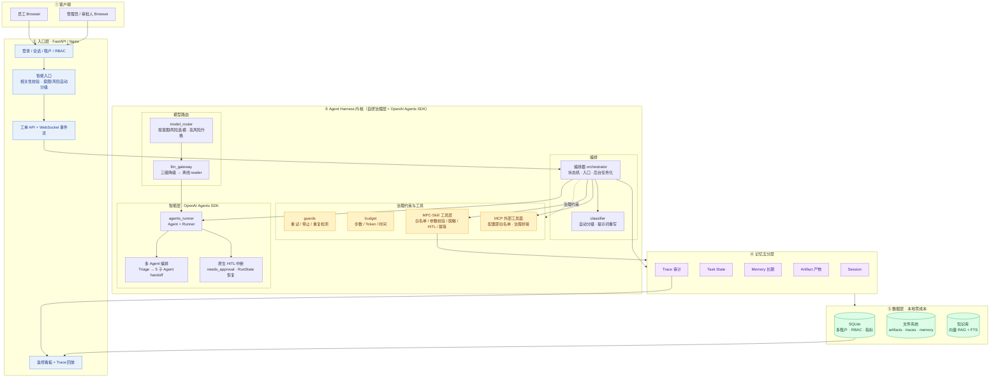
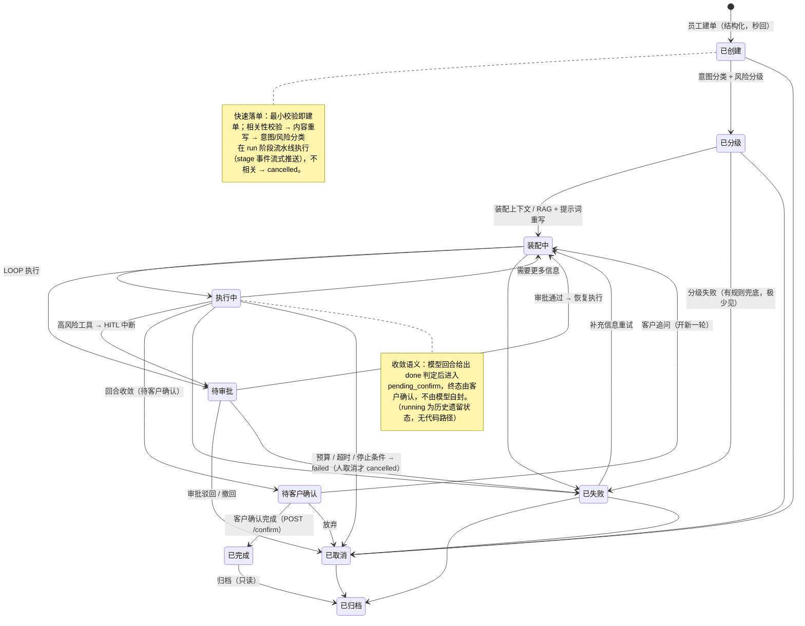

# 企业级混合 Agent 工作流 Demo

> 状态：现行 · 最后校验：2026-08-18 · 校验方式：`python scripts/check_docs.py`（已接入 CI docs-check 门禁）

> **一个企业 IT 工单智能处理系统，展示「企业级 Agent Harness」的 8 大工程能力 + RAG / MCP / 高并发三大亮点。**
> 它不是演示 AI 多聪明，而是演示 **AI 如何被可靠、可控、可审计地接进企业业务**。

- 📚 **文档中心**：全部文档入口见 [`docs/README.md`](docs/README.md)（核心功能 / 架构设计 / 部署运维 / 开发指南 / 面试素材 / 归档）
- 📋 **面试用**：《[面试文档](docs/05-面试素材/面试文档.md)》（30 秒介绍 + 10 分钟演示脚本 + 能力讲法 + QA 预案）
- 🚀 **本地跑起来**：[快速开始](docs/00-项目概览/快速开始.md) · [部署手册](docs/03-部署运维/部署手册.md)
- 🗺️ **亮点 → 代码映射**（11 条主线，可追溯可验证）：[能力-代码映射表](docs/01-核心功能/06-能力-代码映射表.md)
- ✅ **里程碑**：M1 骨架 ✓ · M2 Harness 内核 ✓ · M3 前端/知识库/部署 ✓ · M4 OpenAI Agents SDK 演进 ✓ · **M5 MCP 集成 ✓** · **架构高并发加固阶段 1 ✓**（演进记录见 [里程碑-M1至M5](docs/99-归档/里程碑-M1至M5.md)）

---

## 开场 30 秒：项目定位

```text
员工提交 IT 工单（查权限 / 开通账号 / 排查故障 / 改配置）
        │
        ▼
  企业级 Agent Harness（治理层自研 + LLM 循环用 OpenAI Agents SDK）
        │  —— 可靠：状态机约束、幂等、预算、停止条件
        │  —— 可控：IAM 最小权限、工具白名单、HITL 审批
        │  —— 可审计：Trace 全链路回放、监控指标
        ▼
  回合收敛 → 待客户确认（pending_confirm）→ 确认后关闭工单并交付
```

**一句话讲稿**：我把"单体大模型应用"拆成了**受控规则层（Harness）+ 智能层（LLM）**，让大模型只负责判断，把执行权交给确定性的流程与审批；LLM 循环交由 OpenAI Agents SDK 编排（Triage → 5 个子 Agent handoff），治理层（状态机/审批/预算/Trace）仍由自研 Harness 掌控。

---

## 系统架构图



---

## 工单状态机（确定性流程约束）



---

## 8 大能力 + 3 大亮点 → Demo 映射图

```mermaid
flowchart LR
  classDef root fill:#0f172a,stroke:#0ea5e9,color:#fff,stroke-width:2px
  classDef cap1 fill:#1d4ed8,stroke:#1e40af,color:#fff,stroke-width:1px
  classDef cap2 fill:#0e7490,stroke:#155e75,color:#fff,stroke-width:1px
  classDef cap3 fill:#15803d,stroke:#166534,color:#fff,stroke-width:1px
  classDef cap4 fill:#b45309,stroke:#92400e,color:#fff,stroke-width:1px
  classDef cap5 fill:#6d28d9,stroke:#5b21b6,color:#fff,stroke-width:1px
  classDef cap6 fill:#be185d,stroke:#9d174d,color:#fff,stroke-width:1px
  classDef cap7 fill:#c2410c,stroke:#9a3412,color:#fff,stroke-width:1px
  classDef cap8 fill:#475569,stroke:#334155,color:#fff,stroke-width:1px
  classDef leaf1 fill:#dbeafe,stroke:#93c5fd,color:#1e3a8a
  classDef leaf2 fill:#cffafe,stroke:#67e8f9,color:#164e63
  classDef leaf3 fill:#dcfce7,stroke:#86efac,color:#14532d
  classDef leaf4 fill:#fef3c7,stroke:#fde68a,color:#78350f
  classDef leaf5 fill:#ede9fe,stroke:#c4b5fd,color:#4c1d95
  classDef leaf6 fill:#fce7f3,stroke:#f9a8d4,color:#831843
  classDef leaf7 fill:#ffedd5,stroke:#fdba74,color:#7c2d12
  classDef leaf8 fill:#f1f5f9,stroke:#cbd5e1,color:#334155

  root(("企业级 Agent Harness<br/>8 大工程能力 + 3 大亮点"))

  c1((① 流程定义)); c2((② 业务入口)); c3((③ 核心 LOOP)); c4((④ 业务出口))
  c5((⑤ 工具层)); c6((⑥ Trace)); c7((⑦ 监控评估)); c8((⑧ 预算))

  a1[目标清晰化]; a2[隐性知识沉淀]; a3[Agent vs Workflow]; a4[风险边界]
  root --> c1 --> a1 & a2 & a3 & a4

  b1[鉴权 密码 / SSO]; b2[租户隔离]; b3[IAM 最小权限]; b4[输入安全分级]
  root --> c2 --> b1 & b2 & b3 & b4

  d1[上下文装配（选 / 压 / 截）]; d2[模型路由]; d3[四层安全约束]; d4[工具调用纪律]
  d5[记忆五分层]; d6[异常处理]
  root --> c3 --> d1 & d2 & d3 & d4 & d5 & d6

  e1[审批 HITL]; e2[收敛 → 客户确认]; e3[交付归档]
  root --> c4 --> e1 & e2 & e3

  f1[最小权限]; f2[白名单]; f3[参数校验]; f4[脱敏]
  f5[HITL 审批]; f6[幂等重试补偿]; f7[审计日志]
  root --> c5 --> f1 & f2 & f3 & f4 & f5 & f6 & f7

  g1[模型 / 提示词版本]; g2[上下文来源]; g3[工具 · 状态变化]; g4[Token / 延迟 / 重试]
  root --> c6 --> g1 & g2 & g3 & g4

  h1[成功率]; h2[正确失败率]; h3[延迟 / 成本]; h4[人工接管率]
  root --> c7 --> h1 & h2 & h3 & h4

  i1[步数 / Token / 时间]; i2[触顶终止]
  root --> c8 --> i1 & i2

  root --> x9((⑨ RAG)); root --> x10((⑩ MCP)); root --> x11((⑪ 高并发))
  x9 --> r1[双路召回 + RRF 融合]; r2[rerank 精排]; r3[16 条评测基线]
  x10 --> m1[配置即白名单]; m2[治理桥接]; m3[CmdbAgent 外部工具面]
  x11 --> q1[后台任务化 queued]; q2[每工单互斥锁]; q3[乐观锁 + 分页]

  class root root
  class c1 cap1; class c2 cap2; class c3 cap3; class c4 cap4
  class c5 cap5; class c6 cap6; class c7 cap7; class c8 cap8
  class a1,a2,a3,a4 leaf1
  class b1,b2,b3,b4 leaf2
  class d1,d2,d3,d4,d5,d6 leaf3
  class e1,e2,e3 leaf4
  class f1,f2,f3,f4,f5,f6,f7 leaf5
  class g1,g2,g3,g4 leaf6
  class h1,h2,h3,h4 leaf7
  class i1,i2 leaf8
```



> 每条主线到「代码模块 → 具体函数 → 验证命令」的完整映射，见 [能力-代码映射表](docs/01-核心功能/06-能力-代码映射表.md)。

---

## 技术栈速览

| 层 | 选型 | 为什么 |
|---|---|---|
| 后端 | Python + FastAPI | 轻量、结构化、面试可逐行讲解 |
| Workflow | 自研状态机 | 不用 LangGraph，快照/HITL 原理可控可讲 |
| LLM 编排 | OpenAI Agents SDK（`openai-agents==0.20.0`） | `agent+Runner` 原生工具循环 / 多 Agent handoff / 原生 HITL 中断 |
| 模型 | OpenRouter 主 ⇄ Ollama 兜底 ⇄ 离线 reader | `RouterProvider` 统一 Chat Completions，三级降级离线可演示 |
| RAG | LanceDB 向量 + SQLite FTS5 + rerank | 双路召回 + RRF + 精排，16 条标注评测基线（recall@1 0.938→1.000） |
| MCP | `mcp==2.0.0`（stdio + streamable_http） | 外部工具标准接入，**连接可以外包，治理不能外包** |
| 存储 | SQLite（WAL）+ 文件系统 | 单机、0 成本、状态外部化 |
| 前端 | Next.js 14 (App Router) | 贴近真实企业栈，与 FastAPI 解耦，面试加分 |
| 部署 | Docker Compose + Nginx（单机） | 阿里云 Ubuntu 零成本上线；CI 自动部署 + 文档门禁 |

---

## 演示路径（面试 10 分钟版）

1. 建一张「开通 DB 只读账号」的高风险工单 → 秒级建单 + 流式 stage 进度 + 风险自动分级
2. 看 Agent LOOP：上下文装配（选/压/截）、Triage → 子 Agent handoff、工具白名单、脱敏
3. 触发 HITL：工单进入审批 → 审批台批准 → 恢复执行 → 回合收敛 → **客户确认** → done
4. 打开 Trace 时间线：模型版本 / 提示词版本 / 工具调用 / 状态转移一屏可见
5. 亮出 MCP：CmdbAgent 查 CMDB（`/api/mcp/servers` 现场展示白名单与 risk 映射）
6. 打开 `/metrics`：成功率、正确失败率、延迟、成本、人工接管率
7. 收尾：讲「切 Ollama / 走 SSO / 上 K8s / 换 PG」——展示可演进性

---

## 文档与质量保障

- **文档中心**：[`docs/README.md`](docs/README.md) —— 目录结构与维护铁律（单一权威源 / 代码与文档同 PR / 归档隔离）
- **静态校验**：`python scripts/check_docs.py` 校验全部文档的链接、代码路径、函数符号、配置键、端口与映射表；已接入 GitHub Actions（`docs-check` job，失败阻断部署）
- **测试基线**：`python scripts/run_all_tests.py`（离线确定性全分支）+ 各专项冒烟（MCP / RBAC / RAG 评测），见 [测试指南](docs/04-开发指南/测试指南.md)
