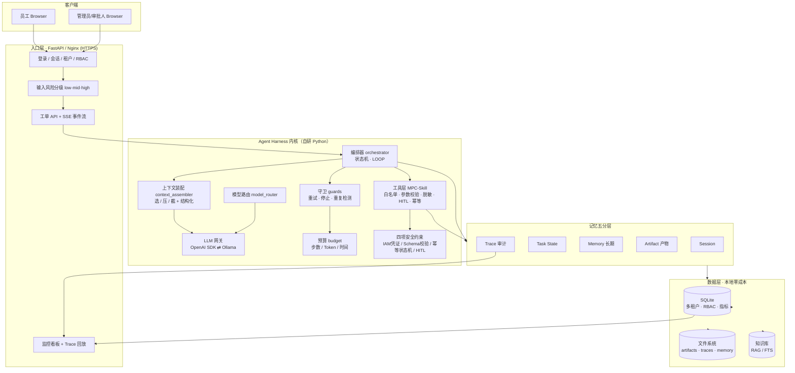
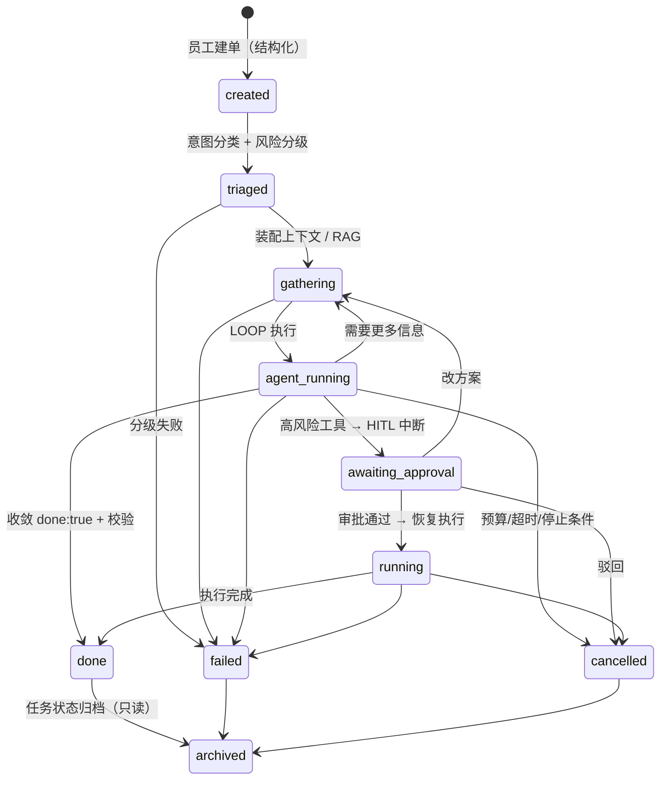
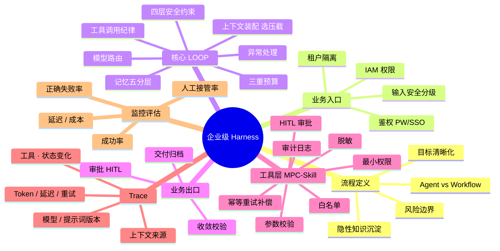

# 企业级混合 Agent 工作流 Demo

> **一个企业 IT 工单智能处理系统，展示"企业级 Agent Harness"的 8 大工程能力。**
> 它不是演示 AI 多聪明，而是演示 **AI 如何被可靠、可控、可审计地接进企业业务**。

- 详细开发文档：请见 [`doc/开发文档.md`](doc/开发文档.md)
- 学习笔记原文：[`doc/学习笔记.md`](doc/学习笔记.md)

---

## 开场 30 秒：项目定位

```text
员工提交 IT 工单（查权限 / 开通账号 / 排查故障 / 改配置）
        │
        ▼
  企业级 Agent Harness（自研，非 LangGraph）
        │  —— 可靠：状态机约束、幂等、预算、停止条件
        │  —— 可控：IAM 最小权限、工具白名单、HITL 审批
        │  —— 可审计：Trace 全链路回放、监控指标
        ▼
  关闭工单并交付（审批通过 / 自动收敛 / 归档存档）
```

**一句话讲稿**：我把"单体大模型应用"拆成了**受控规则层（Harness）+ 智能层（LLM）**，让大模型只负责判断，把执行权交给确定性的流程与审批。

---

## 系统架构图



---

## 工单状态机（确定性流程约束）



---

## 8 大能力 → Demo 映射图



---

## 技术栈速览

| 层 | 选型 | 为什么 |
|---|---|---|
| 后端 | Python + FastAPI | 轻量、结构化、面试可逐行讲解 |
| Workflow | 自研状态机 | 不用 LangGraph，快照/HITL 原理可控可讲 |
| LLM | OpenAI SDK ⇄ Ollama | 统一 `/v1/chat/completions`，一个开关切换 |
| 存储 | SQLite + 文件系统 | 单机、0 成本、状态外部化 |
| 前端 | Next.js (App Router) | 贴近真实企业栈，与 FastAPI 解耦，面试加分 |
| 部署 | Docker Compose + Nginx + HTTPS | 阿里云 Ubuntu 单机零成本上线 |

---

## 演示路径（面试 10 分钟版）

1. 建一张"开通 DB 只读账号"的高风险工单 → 展示风险分级 + 权限收敛
2. 看 Agent LOOP：上下文装配（选/压/截）、工具白名单、脱敏
3. 触发 HITL：工单进入审批 → 审批台批准 → 恢复执行
4. 打开 Trace 时间线：模型版本 / 提示词版本 / 工具调用 / 状态转移一屏可见
5. 打开 `/metrics`：成功率、正确失败率、延迟、成本、人工接管率
6. 收尾：讲"切 Ollama / 走 SSO / 上 K8s 怎么做"——展示可演进性
