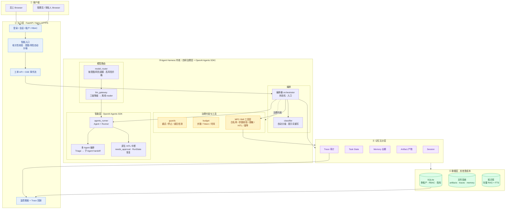
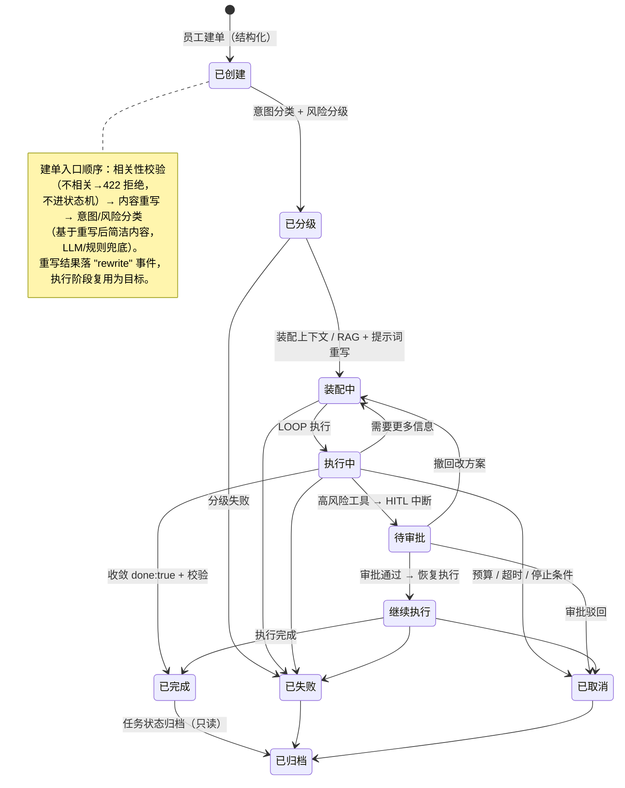

# 企业级混合 Agent 工作流 Demo

> **一个企业 IT 工单智能处理系统，展示"企业级 Agent Harness"的 8 大工程能力。**
> 它不是演示 AI 多聪明，而是演示 **AI 如何被可靠、可控、可审计地接进企业业务**。

- 📋 **面试用**：《[面试文档](doc/面试文档.md)》（30 秒介绍 + 10 分钟演示脚本 + 能力讲法 + QA 预案）
- 详细开发文档：请见 [`doc/开发文档.md`](doc/开发文档.md)
- 进度说明：**M1 骨架 ✓ · M2 Harness 内核 ✓ · M3 前端/知识库/部署 ✓ · M4 OpenAI Agents SDK 演进 ✓**（各阶段见 `M1_README.md` · `M2_README.md` · `M3_README.md` · `M4_README.md`）
- 学习笔记原文：[`doc/学习笔记.md`](doc/学习笔记.md)

---

## 开场 30 秒：项目定位

```text
员工提交 IT 工单（查权限 / 开通账号 / 排查故障 / 改配置）
        │
        ▼
  企业级 Agent Harness（治理层自研 + LLM 循环用 OpenAI Agents SDK）
        │  —— 可靠：状态机约束、幂等、预算、停止条件
        │  —— 可控：IAM 最小权限、工具白名单、HITL 审批
        │  —— 可审计：Trace 全链路回放、监控指标
        ▼
  关闭工单并交付（审批通过 / 自动收敛 / 归档存档）
```

**一句话讲稿**：我把"单体大模型应用"拆成了**受控规则层（Harness）+ 智能层（LLM）**，让大模型只负责判断，把执行权交给确定性的流程与审批；LLM 循环交由 OpenAI Agents SDK 编排（triage → 子 Agent handoff），治理层（状态机/审批/预算/Trace）仍由自研 Harness 掌控。

---

## 系统架构图



---

## 工单状态机（确定性流程约束）



---

## 8 大能力 → Demo 映射图

```mermaid
flowchart LR
  classDef root fill:#0f172a,stroke:#0ea5e9,color:#fff,stroke-width:2px
  classDef cap1 fill:#1d4ed8,stroke:#1e40af,color:#fff,stroke-width:1px
  classDef cap2 fill:#0e7490,stroke:#155e75,color:#fff,stroke-width:1px
  classDef cap3 fill:#15803d,stroke:#166534,color:#fff,stroke-width:1px
  classDef cap4 fill:#b45309,stroke:#92400e,color:#fff,stroke-width:1px
  classDef cap5 fill:#6d28d9,stroke:#5b21b6,color:#fff,stroke-width:1px
  classDef cap6 fill:#be185d,stroke:#9d174d,color:#fff,stroke-width:1px
  classDef cap7 fill:#c2410c,stroke:#9a3412,color:#fff,stroke-width:1px
  classDef cap8 fill:#475569,stroke:#334155,color:#fff,stroke-width:1px
  classDef leaf1 fill:#dbeafe,stroke:#93c5fd,color:#1e3a8a
  classDef leaf2 fill:#cffafe,stroke:#67e8f9,color:#164e63
  classDef leaf3 fill:#dcfce7,stroke:#86efac,color:#14532d
  classDef leaf4 fill:#fef3c7,stroke:#fde68a,color:#78350f
  classDef leaf5 fill:#ede9fe,stroke:#c4b5fd,color:#4c1d95
  classDef leaf6 fill:#fce7f3,stroke:#f9a8d4,color:#831843
  classDef leaf7 fill:#ffedd5,stroke:#fdba74,color:#7c2d12
  classDef leaf8 fill:#f1f5f9,stroke:#cbd5e1,color:#334155

  root(("企业级 Agent Harness<br/>8 大工程能力"))

  c1((① 流程定义)); c2((② 业务入口)); c3((③ 核心 LOOP)); c4((④ 业务出口))
  c5((⑤ 工具层 MPC-Skill)); c6((⑥ Trace)); c7((⑦ 监控评估)); c8((⑧ 预算))

  a1[目标清晰化]; a2[隐性知识沉淀]; a3[Agent vs Workflow]; a4[风险边界]
  root --> c1 --> a1 & a2 & a3 & a4

  b1[鉴权 密码 / SSO]; b2[租户隔离]; b3[IAM 最小权限]; b4[输入安全分级]
  root --> c2 --> b1 & b2 & b3 & b4

  d1[上下文装配（选 / 压 / 截）]; d2[模型路由]; d3[四层安全约束]; d4[工具调用纪律]
  d5[记忆五分层]; d6[异常处理]
  root --> c3 --> d1 & d2 & d3 & d4 & d5 & d6

  e1[审批 HITL]; e2[收敛校验 done:true]; e3[交付归档]
  root --> c4 --> e1 & e2 & e3

  f1[最小权限]; f2[白名单]; f3[参数校验]; f4[脱敏]
  f5[HITL 审批]; f6[幂等重试补偿]; f7[审计日志]
  root --> c5 --> f1 & f2 & f3 & f4 & f5 & f6 & f7

  g1[模型 / 提示词版本]; g2[上下文来源]; g3[工具 · 状态变化]; g4[Token / 延迟 / 重试]
  root --> c6 --> g1 & g2 & g3 & g4

  h1[成功率]; h2[正确失败率]; h3[延迟 / 成本]; h4[人工接管率]
  root --> c7 --> h1 & h2 & h3 & h4

  i1[步数 / Token / 时间]; i2[触顶终止]
  root --> c8 --> i1 & i2

  class root root
  class c1 cap1; class c2 cap2; class c3 cap3; class c4 cap4
  class c5 cap5; class c6 cap6; class c7 cap7; class c8 cap8
  class a1,a2,a3,a4 leaf1
  class b1,b2,b3,b4 leaf2
  class d1,d2,d3,d4,d5,d6 leaf3
  class e1,e2,e3 leaf4
  class f1,f2,f3,f4,f5,f6,f7 leaf5
  class g1,g2,g3,g4 leaf6
  class h1,h2,h3,h4 leaf7
  class i1,i2 leaf8
```



---

## 技术栈速览

| 层 | 选型 | 为什么 |
|---|---|---|
| 后端 | Python + FastAPI | 轻量、结构化、面试可逐行讲解 |
| Workflow | 自研状态机 | 不用 LangGraph，快照/HITL 原理可控可讲 |
| LLM 编排 | OpenAI Agents SDK（OpenRouter 主 ⇄ Ollama 兜底） | `agent+Runner` 原生工具循环/多 Agent handoff；`RouterProvider` 统一 Chat Completions |
| 存储 | SQLite + 文件系统 | 单机、0 成本、状态外部化 |
| 前端 | Next.js 14 (App Router) | 贴近真实企业栈，与 FastAPI 解耦，面试加分 |
| 部署 | Docker Compose + Nginx + HTTPS | 阿里云 Ubuntu 单机零成本上线 |

---

## 演示路径（面试 10 分钟版）

1. 建一张"开通 DB 只读账号"的高风险工单 → 展示风险分级 + 权限收敛
2. 看 Agent LOOP：上下文装配（选/压/截）、工具白名单、脱敏
3. 触发 HITL：工单进入审批 → 审批台批准 → 恢复执行
4. 打开 Trace 时间线：模型版本 / 提示词版本 / 工具调用 / 状态转移一屏可见
5. 打开 `/metrics`：成功率、正确失败率、延迟、成本、人工接管率
6. 收尾：讲"切 Ollama / 走 SSO / 上 K8s 怎么做"——展示可演进性

---

## 函数级调用日志（调试/追踪）

后端内置可开关的函数级日志埋点，用于回答「每次操作到底执行了哪些 py 函数」。

- 开关：`.env` 中 `APP_LOG_LEVEL=info`（`off` 关闭 | `info` 记录请求路由+核心函数进入/退出 | `debug` 同 `info`，预留扩展）。
- 输出：写入项目目录 `logs/`，按日期命名，同一天累加到同一文件（如 `logs/2026-08-13.log`），文件内含时间戳与函数名，便于 `grep`。
  ```
  [10:15:03]  TRACE  enter  orchestrator._run_loop
  [10:15:03]  TRACE  exit   orchestrator._run_loop  ok
  [10:15:03]  REQUEST  POST  /api/tickets  ->  api.tickets.create_ticket
  ```
- 埋点位置：所有 API 端点（`app/api/*.py`，经 `app/main.py` 中间件记录请求→函数）＋编排核心（`app/orchestrator.py` 的 `run_ticket`/`resume_ticket`/`_run_loop`/`_plan_and_execute`/`_execute_tool`）。
- 与 DB `traces`/`ticket_events`/`tool_calls` 表互补：DB 存业务/trace 数据用于回放，日志给实时函数级调用链。

---

## RAG 检索增强（整改⑧）

企业知识库检索链路升级为「查询改写(可选) → 双路召回 → RRF 融合 → rerank 精排」，并补齐数据生命周期与评测基线。

**检索流水线**（`app/kb.py` → `app/vector_kb.py` + `app/rerank.py`）：

```
query ──(可选 LLM 查询改写)──► 向量召回(LanceDB) ─┐
                                 关键词召回(FTS5+LIKE) ─┴─► RRF 融合 ──► rerank 精排 ──► top_k
```

**① 分块 small-to-big**：子块（`VECTOR_CHUNK_SIZE=500`，用于检索命中）+ 父块（`VECTOR_PARENT_CHUNK_SIZE=1500`，命中时携带的大上下文，`RAG_RETURN_PARENT` 控制是否返回）；并从 `第X章 / X.X / # 标题` 样式行提取结构化 `path` 元数据（如 `目的 > 1 申请与业务审批`）。

**② 召回优化**：
- LLM 查询改写（`RAG_QUERY_REWRITE_ENABLED`，默认关）：口语化提问 → 检索友好关键词，失败自动回落原文；
- 自适应加权 RRF（`RAG_ADAPTIVE_WEIGHT`，默认关）：术语/编号型查询上调关键词权重、口语长句上调向量权重。

**③ 重排序（rerank）**：
- 主用 OpenRouter `POST /api/v1/rerank`（默认 `nvidia/llama-nemotron-rerank-vl-1b-v2:free`）；
- 兜底 Ollama `/api/rerank`（配置 `bce-reranker-base_v1`）：**注意**——当前 Ollama 主线（≤0.32.x）无原生 rerank 端点（404），实现为「探测一次 + 优雅降级」：探测可用则用，不可用自动降级为 RRF 顺序，绝不中断检索链路；
- 召回候选先放大 `RERANK_RECALL_FACTOR` 倍再精排取 top_k。

**④ 索引与数据生命周期**：
- 增量维护：`add_document`/`delete_document` 走「向量 upsert/delete + FTS 行级同步」，不再整库重建（`rebuild_indexes` 保留给 seed）；
- tag 元数据过滤：`search(query, top_k, tag=...)` 向量路与关键词路都按 tag 过滤（企业多业务线隔离）；
- embedding 维度漂移校验（`VECTOR_EMBED_DIM_CHECK`，默认开）：主/兜底模型维度不一致直接报错，防写坏索引；
- ANN 近似索引开关（`VECTOR_ANN_ENABLED`，默认关）：小库精确扫描更快更准；数据量上来后开（`IVF_PQ` / `IVF_HNSW_SQ`）。

**⑤ 评测基线**：`scripts/eval_rag.py` 基于真实播种文档（IT-SOP-001 / IT-SEC-002 / IT-CHG-003）标注 16 条查询，计算 recall@1/3、MRR、nDCG@3：
```bash
.venv/bin/python scripts/eval_rag.py --compare   # rerank on/off 对比
.venv/bin/python scripts/eval_rag.py --detail    # 打印每条命中明细
```
实测对比（16 条查询）：rerank 开启后 **recall@1 0.812 → 1.000（+18.8%）**，MRR 0.896 → 1.000，nDCG@3 0.923 → 1.000。

