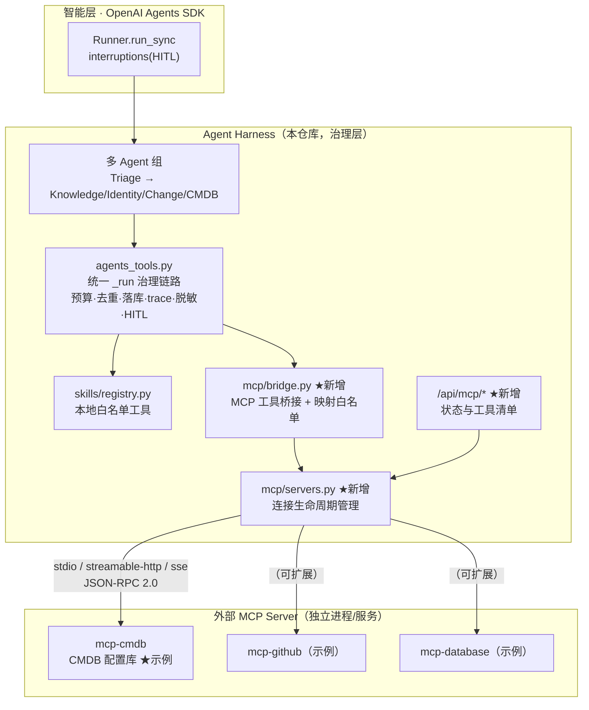

# MCP（Model Context Protocol）集成设计方案

> 目标：在不破坏现有「治理层自研 + 智能层 SDK」架构的前提下，把 MCP 作为**新的外部工具/数据源接入标准**引入本 Demo，延续「可靠、可控、可审计」的核心叙事。
> 适用范围：本设计基于当前代码（M4，`openai-agents==0.20.0`），所有 API 签名已在本机 venv 中实测确认。

---

## 1. 背景：MCP 是什么，为什么值得加入

### 1.1 一句话

MCP（Model Context Protocol，Anthropic 2024-11 开源，OpenAI/Google/阿里等已跟进支持）是一个**开放、标准化的 JSON-RPC 2.0 协议**，把「LLM 应用 ↔ 外部工具/数据源」的对接从 N×M 的私有适配，收敛为 M×1 的通用连接：任何 MCP Server（GitHub、数据库、CMDB、工单系统……）只需实现一次协议，任何 MCP Client 都能直接使用其工具。

### 1.2 与本项目现状的关系

本项目当前的工具面是 **MPC-Skill 自研工具层**：

```
app/skills/registry.py   ← 硬编码白名单注册表（register_tool：name/risk/roles/description）
app/skills/*.py          ← 工具实现（grant/user_dir/kb），业务逻辑内嵌在代码里
app/agents_tools.py      ← 包装成 SDK function_tool，统一治理：预算/去重/tool_calls/trace/事件
app/agents_defs.py       ← 按职责分给 4 个 Agent（Triage + Knowledge/Identity/Change）
```

**差距**：工具面是「写死在本仓库的私有代码」。真实企业里，工具往往在别的团队/别的系统里（CMDB、监控平台、OA、数据库）——靠「fork 代码进来注册」不可扩展。

**MCP 的价值**：工具实现可以**外置**到独立的 MCP Server 进程/服务，本项目只保留「治理壳」——这正是本项目叙事（执行权交给确定性的流程与治理）的自然延伸：**工具实现可以外包，治理不能外包**。

### 1.3 一个面试金句

> 「工具可以长在外部系统里（MCP），但工具能不能被调、由谁调、调完留什么痕，必须由我们的 Harness 说了算——这就是 MPC-Skill 与 MCP 的分工：**MCP 解决'连接'，我们解决'治理'**。」

---

## 2. 设计原则（红线）

| # | 原则 | 落地 |
|---|---|---|
| R1 | **MCP 工具绝不绕过现有治理** | 所有 MCP 工具调用必须经过 `_run` 治理链路（预算 / 去重 / tool_calls 落库 / trace / ticket_events / 脱敏），与本地工具完全一致 |
| R2 | **动态工具也要白名单** | MCP Server 暴露的工具**不能自动全量放行**；必须在映射表里显式声明（工具名 → 风险 / 角色 / 审批），未声明的默认拒绝 |
| R3 | **工具命名全局唯一** | MCP 工具统一命名 `{server}__{tool}`（如 `cmdb__query_asset`），与本地工具不冲突、Trace 可溯源 |
| R4 | **双链路一致** | SDK 主链路（agents_runner）与降级链路（传统 LLMGateway）都能用 MCP 工具，行为一致 |
| R5 | **外挂优先、本地兜底** | MCP Server 连接失败/超时 → 工具对该次运行不可用（或按配置降级到本地等价工具），绝不拖垮 Agent 主流程 |
| R6 | **可观测** | trace 的 `context_source="mcp"`、工具名带 server 前缀；tool_calls 表、事件、指标口径不变 |

---

## 3. 总体架构



**接入点定位**：MCP 不是新的 Agent，也不是新的执行循环——它只是 `agents_tools` 之下、`registry` 之侧的**第二种工具后端**。对上层（Agent 定义、Runner、审批、Trace）完全透明。

---

## 4. 模块设计（新增文件）

```
app/mcp/__init__.py
app/mcp/config.py       # 配置加载：mcp_servers.json + 工具映射表（唯一事实源）
app/mcp/servers.py      # MCP server 注册表：连接/断开/重连/健康检查/工具清单缓存
app/mcp/bridge.py       # 桥接：MCP 工具 → 受治理的 function_tool（复用 agents_tools._run）
scripts/mcp_servers/cmdb_server.py   # 示例 MCP Server（stdio）：CMDB 配置库
scripts/smoke_mcp.py    # 冒烟脚本：MCP 工具装配 + 治理断言
```

### 4.1 配置层 `app/mcp/config.py`

配置文件 `mcp_servers.json`（项目根目录，示例见 `deploy/` 或直接放根目录；`.env` 只控制开关与路径）：

```json
{
  "enabled": true,
  "servers": [
    {
      "name": "cmdb",
      "transport": "stdio",                       // stdio | streamable_http | sse
      "command": ".venv/bin/python",              // 对齐 MCPServerStdioParams: command + args
      "args": ["scripts/mcp_servers/cmdb_server.py"],
      "cwd": ".",
      "env": {"CMDB_DATA": "data/cmdb.json"},
      "client_timeout_seconds": 30,
      "max_retry_attempts": 1,
      "tools": {
        "query_asset":       {"risk": "low",    "roles": ["employee", "operator", "admin"]},
        "list_network_devices": {"risk": "low", "roles": ["operator", "admin"]},
        "update_asset_owner":   {"risk": "high", "roles": ["operator", "admin"]}
      }
    },
    {
      "name": "gitlab",
      "transport": "streamable_http",
      "url": "https://mcp.example.com/gitlab",
      "headers": {"Authorization": "Bearer ${GITLAB_MCP_TOKEN}"},   // 支持 ${ENV} 注入，密钥不进 JSON
      "tools": {
        "get_project": {"risk": "low", "roles": ["employee", "operator", "admin"]},
        "create_merge_request": {"risk": "high", "roles": ["operator", "admin"]}
      }
    }
  ]
}
```

设计要点：

- **`tools` 映射表 = 第二道白名单**（第一道是连接本身）。Server 通过 `list_tools` 拉到的工具清单，与映射表取交集才可用；**映射表里没写的工具，即便 Server 暴露了也拒绝装配**（R2）。
- 映射项字段与 `skills/registry.py` 的 `Tool` 完全对齐（name/risk/roles/description），语义一脉相承。
- 密钥（`headers`）支持 `${ENV_VAR}` 占位，从环境变量注入，**明文不落 JSON**（与 `.env` 中 `OPENROUTER_API_KEY` 同风格）。
- 每个工具可覆盖默认值：`timeout`、`max_retry`（默认取 server 级）。

### 4.2 连接生命周期 `app/mcp/servers.py`

```python
"""MCP server 注册表：连接生命周期 + 工具清单缓存（进程内单例，与 skills/registry 同风格）。"""
from __future__ import annotations

import subprocess
from dataclasses import dataclass, field

try:
    from agents.mcp import (
        MCPServerStdio, MCPServerSse, MCPServerStreamableHttp,
        MCPServerStdioParams, MCPServerSseParams, MCPServerStreamableHttpParams,
        create_static_tool_filter,
    )
    _MCP_OK = True
except Exception:                       # pragma: no cover
    _MCP_OK = False

@dataclass
class McpConnection:
    name: str
    transport: str
    server: object = None               # MCPServer 实例
    tools: dict = field(default_factory=dict)   # 已发现工具: name -> MCPTool
    healthy: bool = False
    error: str = ""

class McpRegistry:
    """全局注册表：name -> McpConnection。懒连接 + 按需重连 + 工具清单缓存。"""

    def __init__(self, config):
        self._conns: dict[str, McpConnection] = {}
        self._config = config

    def list_servers(self) -> list[dict]: ...       # 状态快照（/api/mcp 用）

    def get_connection(self, name: str, refresh: bool = False) -> McpConnection:
        """懒连接：首次访问才拉起 server（stdio 起子进程 / http 握手）；
        健康检查失败且 refresh=True 时重建。全部失败抛 McpUnavailable。"""

    def _build_server(self, cfg) -> object:
        """按 transport 构造 MCPServer：
        - stdio:           MCPServerStdio(MCPServerStdioParams(command=..., args=..., cwd=..., env=...), name=...)
        - streamable_http: MCPServerStreamableHttp(params=MCPServerStreamableHttpParams(url=..., headers=...))
        - sse:             MCPServerSse(params=MCPServerSseParams(url=...))
        统一挂 create_static_tool_filter(allowed_tool_names=映射表工具名)——
        SDK 层再兜一道白名单（防御纵深，见 §6 安全）。
        """

    def list_tools(self, name: str) -> list[dict]:  # server 的完整工具清单（含 schema）
    def disconnect(self, name: str) -> None:        # 断开并清缓存（管理端点/演示用）
    def disconnect_all(self) -> None:               # 应用关闭时清理子进程
```

关键决策：

1. **懒连接**：进程启动不拉起任何 MCP server；只有当某 Agent 装配了该 server 的工具且首次调用时才连接。理由：Demo 单机运行，MCP server 是外部依赖，不能成为启动故障点（R5）。
2. **SDK 层兜底过滤**：构造 `MCPServer` 时传 `tool_filter=create_static_tool_filter(allowed_tool_names=映射表交集)`——即使我们自己的装配逻辑有 bug，SDK 侧也不会把未映射工具暴露给模型（R2 纵深防御）。
3. **超时与重试**：`client_session_timeout_seconds` + `max_retry_attempts` 全部配置化；连接失败记 `tracelog` 与事件，但**不抛到 Agent 主流程**——该 server 的工具在这次运行中标记不可用（R5）。
4. **进程清理**：`disconnect_all()` 挂在 FastAPI `lifespan` 关闭钩子，防止 stdio 子进程泄漏。

### 4.3 桥接层 `app/mcp/bridge.py`（核心）

把 MCP 工具包装成**走既有 `_run` 治理链路**的 function_tool。这里的关键设计：**不直接 `MCPUtil.get_function_tools` 挂 Agent**（那会绕过预算/去重/落库/脱敏），而是用 `MCPUtil.invoke_mcp_tool` 作为「执行后端」，复刻 `agents_tools._run` 的治理包裹：

```python
"""MCP 工具桥接：MCP 工具 → 受治理的 function_tool（治理语义与 agents_tools._run 完全一致）。"""
from __future__ import annotations

import time
import json

from .. import daos
from .. import trace as trace_mod
from ..budget import BudgetExceeded
from ..guards import fingerprint, is_duplicate
from ..skills.masker import mask_value            # 复用现有脱敏
from . import servers as mcp_servers

def _invoke_mcp(ctx, conn_name: str, tool_name: str, params: dict):
    """治理执行体（与 agents_tools._run 同构）：
    预算检查 → 去重 → invoke_mcp_tool → tool_calls 落库 → trace(context_source="mcp")
    → ticket_events → consume_step。治理异常记入 RunContext，由 runner 抛出。"""
    c = getattr(ctx, "context", None) or {}
    ticket_id, actor, budget, req_id = c["ticket_id"], c["actor"], c["budget"], c.get("req_id", "")

    conn = mcp_servers.get_connection(conn_name)   # 懒连接；失败 → 工具级错误（不抛治理异常）
    tool = conn.tools.get(tool_name)
    if tool is None:
        _record_tool_error(ctx, f"{conn_name}__{tool_name}", RuntimeError(f"MCP 工具不可用: {tool_name}"))
        return {"status": "error", "error": f"MCP 工具不可用: {tool_name}"}

    budget.check()                                 # ① 预算
    if is_duplicate(ticket_id, f"{conn_name}__{tool_name}", params):
        ...                                        # ② 去重
    before = _ticket_status(ticket_id)
    t0 = time.time()
    try:
        out = mcp_servers.invoke_tool(conn, tool, params)   # MCPUtil.invoke_mcp_tool
        resp = {"ok": True, "result": _sanitize(out)}       # ③ 输出脱敏
        status = "done"
    except Exception as e:
        resp, status = {"ok": False, "error": str(e)}, "failed"
    latency = int((time.time() - t0) * 1000)
    daos.record_tool_call(ticket_id, f"{mcp}__{tool}", params, resp.get("result", resp),
                          status, fingerprint(f"ticket:{ticket_id}", f"{mcp}__{tool}", params), latency)
    trace_mod.write(req_id, ticket_id, model=c.get("model", ""), provider=c.get("provider", ""),
                    prompt_version=_prompt_version(), tool_name=f"{conn_name}__{tool_name}",
                    io={"params": params, "result": resp.get("result", resp)},
                    state_before=before, state_after=_ticket_status(ticket_id),
                    latency_ms=latency, context_source="mcp")       # ④ Trace 溯源
    daos.add_event(ticket_id, "tool_call", {"tool": f"{conn_name}__{tool_name}", ...}, actor)
    budget.consume_step()
    return resp.get("result", resp)

def build_mcp_tools(role: str, names: list[str]) -> list:
    """按角色+工具名过滤，包装为 function_tool（与 agents_tools.build_agent_tools 同构）。

    - 命名：name_override=f"{server}__{tool}"（全局唯一，R3）
    - 风险分级：映射表 risk=high → needs_approval=True → 复用 SDK 原生 HITL（零改动）
    - 只装配「映射表 ∩ server 实际暴露」的工具；未映射/角色不符一律不装配
    """
```

为什么选「桥接」而非「直接挂载」——两种方案对比：

| 维度 | A. 直接 `get_function_tools` 挂 Agent | B. 桥接进 `_run` 治理链路（本设计） |
|---|---|---|
| 预算/步数 | ✗ 绕过 | ✓ 一致 |
| 去重/幂等 | ✗ 绕过 | ✓ 一致 |
| tool_calls 落库 + ticket_events | ✗ 只进 SDK 远端 trace | ✓ 本地审计全量 |
| 输出脱敏（masker） | ✗ 无 | ✓ 可插拔 |
| HITL 审批 | ✓（SDK 支持 require_approval） | ✓（needs_approval 按映射表 risk） |
| 传统 LLMGateway 降级链路可用 | ✗ 只有 SDK 链路 | ✓ 可再包一层 registry 代理（§5.2） |
| 代码量 | 小 | 中（与 `agents_tools._run` 同构，成本可控） |

**结论**：B 方案多花约 80 行，换来「MCP 工具与本地工具在治理上完全同权」——这正是本项目区别于普通 MCP demo 的卖点。

### 4.4 Agent 装配（改 `app/agents_defs.py`）

新增一个职责子 Agent，演示「外部数据源」接入：

```python
# agents_defs.py 增量
CMDB_TOOLS = ["cmdb__query_asset", "cmdb__list_network_devices"]   # 只读低风险
CHANGE_TOOLS = [..., "cmdb__update_asset_owner"]                   # 高风险 → HITL

cmdb_agent = Agent(
    name="CmdbAgent",
    instructions=_SYSTEM_CMDB,                       # prompts/agents.py 新增
    tools=at.build_mcp_tools(role, CMDB_TOOLS),      # agents_tools 新增入口（转发到 mcp/bridge）
    model=model_fn("cmdb"),
)
# triage handoffs 追加 handoff(cmdb_agent, tool_name_override="transfer_to_cmdb_agent")
```

- **不动现有 4 个 Agent 的任何逻辑**：`build_mcp_tools` 与 `build_agent_tools` 并列，triage 只是多一个 handoff 目标。
- 高风险 MCP 工具（`update_asset_owner`）加入 `CHANGE_TOOLS` 或单独列给 ChangeAgent → `needs_approval=True` → 现有 `_handle_interruptions` / `resume_run` **零改动直接生效**（审批台/Trace 全兼容）。

### 4.5 传统降级链路支持（R4）

`app/orchestrator.py` 的 LLMGateway 循环按「工具名 → `registry.invoke`」执行。为了让降级链路也能用 MCP：

```python
# app/mcp/bridge.py 增量
def register_mcp_proxies():
    """把已映射的 MCP 工具注册为 registry 代理工具（动态注入，不污染本地工具语义）。

    registry.register_tool(name=f"mcp:{server}__{tool}", risk=..., roles=...,
                           description=...)(proxy_fn)
    proxy_fn 内部走 _invoke_mcp（治理逻辑一致，ctx 从调用方透传 ticket_id/actor）。
    """
```

- 工具名统一 `mcp:{server}__{tool}` 前缀，与本地工具在 `tool_calls`/trace 中可区分。
- 降级链路的上下文里没有 SDK RunContext，`_invoke_mcp` 需要兼容「无 ctx」形态（从调用方参数取 ticket_id/actor，或直接拒绝并提示——第一版建议：降级链路**只放行只读低风险 MCP 工具**，写操作强制走 SDK 链路，简化审批语义）。

---

## 5. 安全设计（延续 f1–f7 治理故事）

| 威胁 | 对策 | 落点 |
|---|---|---|
| Server 暴露未授权工具 | ① 配置映射表白名单（未映射拒绝）② SDK `tool_filter` 兜底 | `mcp/config.py` + `servers.py` |
| 工具被角色越权调用 | 映射表 `roles` 过滤（与 `registry.roles_for_tool` 同语义），装配前校验 | `bridge.build_mcp_tools` |
| 高风险写操作无审批 | 映射表 `risk=high` → `needs_approval=True` → SDK 原生 HITL | `bridge` 包装 |
| 参数注入 / 异常输入 | 复用 `skills/registry` 的参数校验思路：映射表可配 `param_schema`（JSON Schema 子集），调用前校验 | `bridge._invoke_mcp` |
| 敏感数据泄漏给模型/前端 | 输出经 `skills.masker` 脱敏（`mask_principal` 等复用） | `bridge._sanitize` |
| 远程 server 伪造 / 中间人 | `streamable_http` 强制 HTTPS + Bearer 鉴权头（`${ENV}` 注入）；stdio 命令必须是**本仓库内相对路径**（防任意命令执行） | `config.py` 校验 |
| stdio 子进程失控（泄漏/卡死） | 统一超时 + `disconnect_all()` 于应用关闭清理；子进程异常退出 → 标记 unhealthy，重试次数耗尽后本轮停用 | `servers.py` |
| 外部依赖拖垮主流程 | 连接失败/超时只降级该 server 的工具，不抛到 Runner；`McpUnavailable` 与 `SdkUnavailable` 同风格 | `servers.py` / `bridge.py` |

---

## 6. 可观测性与管理 API

### 6.1 Trace / 审计（零前端改动）

- `trace_mod.write(..., context_source="mcp")`——前端 Trace 时间线按既有渲染逻辑展示，工具名自带 `cmdb__` 前缀一眼可辨来源。
- `tool_calls` 表、`ticket_events` 完全复用现有表结构与口径。
- SDK tracing（`agents_trace.py`）自动记录 MCP 工具的 span（`MCPServer` 调用在 SDK trace 内），本地 SQLite 双份留痕。

### 6.2 管理端点（新 `app/api/mcp.py`，挂 `app/main.py`）

| 端点 | 作用 | 演示讲点 |
|---|---|---|
| `GET /api/mcp/servers` | 配置的 server 列表 + 连接状态（healthy/error/工具数） | 「外部工具面一屏可见」 |
| `GET /api/mcp/servers/{name}/tools` | 某 server 的完整工具清单 + 映射后的 risk/roles | 「动态工具也过白名单」 |
| `POST /api/mcp/servers/{name}/connect` | 手动触发连接（懒连接外的手动预连，演示用） | — |
| `POST /api/mcp/servers/{name}/disconnect` | 断开连接（演示「外部系统故障 → 优雅降级」） | 故障演练讲点 |

前端（`web/`）可选加一个「MCP 工具面」小页面或在管理后台加 tab——**第二期**，第一期只出 API。

### 6.3 指标

`/metrics` 无需新口径：MCP 工具调用计入现有 `tool_calls` 成功/失败/延迟统计；如需细分可按 `tool_name LIKE 'cmdb__%'` 过滤，或后续在 `daos.record_tool_call` 加 `source` 列（`local|mcp`）。

---

## 7. 示例 MCP Server：mcp-cmdb（面试演示载体）

`scripts/mcp_servers/cmdb_server.py`——纯 Python + 官方 `mcp` SDK（`pip install mcp`），stdio 传输，数据存 `data/cmdb.json`：

```python
"""示例 MCP Server：CMDB 配置管理库（只读查询 + 高风险变更）。"""
from mcp.server.fastmcp import FastMCP

mcp = FastMCP("cmdb")

@mcp.tool()
def query_asset(hostname: str) -> dict:
    """查询服务器资产信息：负责人、机房、IP、业务线（只读）。"""
    ...

@mcp.tool()
def list_network_devices(rack: str | None = None) -> list[dict]:
    """列出网络设备（可选按机架过滤，只读）。"""
    ...

@mcp.tool()
def update_asset_owner(hostname: str, new_owner: str, reason: str) -> dict:
    """变更服务器资产负责人（写操作，需审批）。"""
    ...

if __name__ == "__main__":
    mcp.run(transport="stdio")
```

演示剧本（面试 2 分钟）：

1. **只读**：员工建单「web-01 这台服务器的负责人和机房在哪？」→ Triage → handoff `CmdbAgent` → `cmdb__query_asset` 查询 → 收敛。Trace 里能看到 `context_source=mcp` 的工具调用。
2. **高风险**：运维建单「把 web-01 负责人改成张三」→ `cmdb__update_asset_owner`（`needs_approval=True`）→ 工单进审批台 → 批准 → 恢复同一 run 完成变更 → Trace 回放全链路。
3. **治理对比**（讲点）：同一批工具，如果直接 `get_function_tools` 挂 Agent 就绕过了预算/去重/本地审计；我们的桥接层让 MCP 工具与 `grant_db_readonly` 享受完全相同的治理待遇。

依赖说明：`mcp`（官方 Python SDK）加入 `requirements.txt`（`mcp>=1.0`）。**注意**：`mcp` 包与 `openai-agents` 的 `agents.mcp` 子模块不冲突（一个是独立包、一个是 SDK 内置模块）。

---

## 8. 配置与部署

### 8.1 `.env` 增量

```bash
# ===== MCP 集成（M5）=====
MCP_ENABLED=true                    # 总开关；false 时全部 MCP 功能关闭，行为回到 M4
MCP_CONFIG_PATH=mcp_servers.json    # 配置文件路径
MCP_CONNECT_TIMEOUT=10              # 连接超时（秒）
GITLAB_MCP_TOKEN=                   # 远程 server 鉴权（${ENV} 注入，不进 JSON）
```

### 8.2 Docker 部署

- `Dockerfile` 增加 `pip install mcp`（并入 requirements.txt 即可）；`docker-compose.yml` 无需新服务（stdio server 由主进程拉起；远程 http server 天然外置）。
- 若示例 cmdb server 需要挂载数据，`data/cmdb.json` 已在 volume 内（`data/` 已挂载）。

---

## 9. 分阶段实施计划

| 阶段 | 内容 | 验收标准 |
|---|---|---|
| **P0 最小闭环** | `mcp/config.py` + `servers.py`（stdio 懒连接 + 工具清单）+ `bridge.py`（`_invoke_mcp` 治理体）+ `agents_defs` 挂 `CmdbAgent` + 示例 `cmdb_server.py` + `scripts/smoke_mcp.py` | 冒烟脚本跑通：只读查询 → done；高风险 → awaiting_approval → approve → resume → done；工具调用在 tool_calls/trace 可见 |
| **P1 治理完善** | 参数校验、输出脱敏、超时/重试/健康检查、`/api/mcp` 管理端点、`register_mcp_proxies`（降级链路）、`mcp` 包入 requirements、文档 | `scripts/smoke_mcp.py --all` 全绿；`GET /api/mcp/servers` 可看状态；断开 cmdb 后工单优雅降级 |
| **P2 生态增强** | `streamable_http`/`sse` 远程 server 支持、OAuth/Bearer 鉴权演示、前端「MCP 工具面」页面、工具清单缓存热刷新 | 远程 server 演示（如 github-mcp-server 只读仓库信息）接入；前端展示 server 状态与工具映射表 |

建议顺序：P0 先落（半天工作量，可并入 M5 README），P1/P2 按面试需要裁剪。

---

## 10. 面试讲法（30 秒版）

> **问：你们工具层怎么接外部系统？**
> 答：工具面是两套——本地 MPC-Skill（写死在 registry 的硬白名单）和 MCP（外部工具标准协议）。MCP server 的工具不能直接挂给模型，必须过我们的映射表白名单：谁暴露、暴露什么、什么风险、谁能调、要不要审批，全部显式声明；调用走与本地工具完全相同的治理链路——预算、去重、落库、脱敏、Trace，高风险写操作照样进审批台。工具实现可以外包给外部系统，但**治理不能外包**。这也是我们演示里 `cmdb__update_asset_owner` 和 `grant_db_readonly` 走同一个审批台的原因。

---

## 附：与现有文件的改动清单

| 文件 | 改动 |
|---|---|
| `app/mcp/config.py` `servers.py` `bridge.py` | 新增（MCP 核心三件套） |
| `app/agents_defs.py` | 新增 `CmdbAgent` + handoff；`CHANGE_TOOLS` 增加高风险 MCP 工具 |
| `app/agents_tools.py` | 新增 `build_mcp_tools(role, names)` 入口（转发 bridge） |
| `app/prompts/agents.py` | 新增 `SYSTEM_CMDB` 提示词 |
| `app/api/mcp.py` + `app/main.py` | 新增管理端点并挂载 |
| `app/config.py` / `.env.example` | `MCP_ENABLED` 等配置项 |
| `requirements.txt` | `mcp>=1.0` |
| `scripts/mcp_servers/cmdb_server.py` | 示例 stdio MCP Server |
| `scripts/smoke_mcp.py` | 冒烟/回归脚本 |
| `mcp_servers.json` | 配置文件示例（根目录） |
