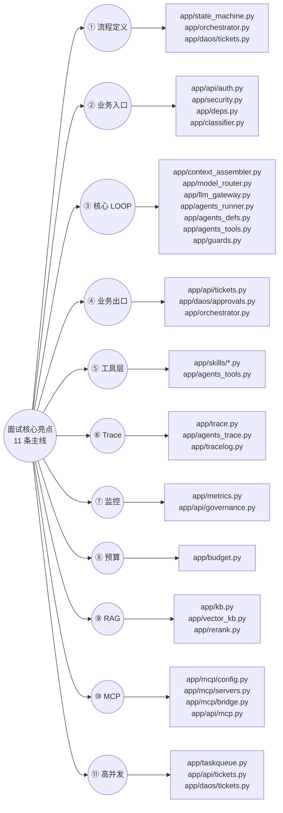

# 能力 · 代码映射表（11 条主线）

> 状态：现行 · 最后校验：2026-08-18 · 校验方式：符号级（`scripts/check_docs.py`）+ 行为实测
> 用途：面试核心亮点（Agent 八大能力 + RAG + MCP + 高并发）的「功能特性 → 代码模块 → 具体函数 → 验证方式」完整映射，保证技术实现**可追溯、可验证**。
> 约定：`关键函数/类` 列使用 `文件相对路径:符号名` 精确引用；`scripts/check_docs.py` 会逐条校验该列符号确实存在于对应文件中（kind=`mapping-symbol`），并校验代码模块列路径存在（kind=`mapping-path`）。
> 维护规则：见文末「维护规则」。任何代码改动涉及表中符号时，必须同 PR 更新本表。

---

## 一、映射总览（11 条主线）

---

## 二、映射表（功能特性 → 代码模块 → 具体函数 → 验证方式）

> `验证方式` 中的命令均可在仓库根目录执行；🔌 = 离线可验证（不依赖真实模型/网络）。

### ① 流程定义（状态机 · 确定性流程约束）

| 功能子项 | 代码模块 | 关键函数/类 | 验证方式 | 关联文档 |
|---|---|---|---|---|
| 状态机定义与非法跳步拦截（含 `pending_confirm` 客户确认态） | `app/state_machine.py` | `app/state_machine.py:can_transition` / `app/state_machine.py:InvalidTransition` | 🔌 `scripts/run_all_tests.py`（非法跳步用例）；`scripts/smoke.py` | 02-架构设计/状态机设计.md |
| 状态持久化 + 审计事件 | `app/daos/tickets.py` | `app/daos/tickets.py:transition` / `app/daos/tickets.py:add_event` | 🔌 建单后 `GET /api/tickets/{id}/events` 观察事件序列 | 01-企业级Agent-Harness.md |
| 编排入口（run/追问/审批恢复） | `app/orchestrator.py` | `app/orchestrator.py:run_ticket` / `app/orchestrator.py:resume_ticket` / `app/orchestrator.py:_run_loop` / `app/orchestrator.py:_entry_stages` | `POST /api/tickets/{id}/run` → `{"status":"queued"}` | 01-企业级Agent-Harness.md |

### ② 业务入口（鉴权 · 租户 · RBAC · 分级）

| 功能子项 | 代码模块 | 关键函数/类 | 验证方式 | 关联文档 |
|---|---|---|---|---|
| 登录 / 会话 / 密码哈希（PBKDF2） | `app/api/auth.py` + `app/security.py` | `app/api/auth.py:login` / `app/security.py:create_session` / `app/security.py:resolve_token` / `app/security.py:verify_password` | 🔌 `POST /api/auth/login`（admin/pass123） | 01-企业级Agent-Harness.md |
| RBAC 角色控制（三角色） | `app/deps.py` | `app/deps.py:current_user` / `app/deps.py:require_role` | 🔌 `scripts/rbac_smoke.py`（角色可见范围与删除权限） | 01-企业级Agent-Harness.md |
| 租户隔离（tenant_id 贯穿） | `app/daos/tickets.py` | `app/daos/tickets.py:list_tickets` | 🔌 `scripts/rbac_smoke.py` | 01-企业级Agent-Harness.md |
| 输入安全：相关性校验 / 内容重写 / 意图风险分级 | `app/classifier.py` | `app/classifier.py:relevance_check` / `app/classifier.py:rewrite_content` / `app/classifier.py:classify` / `app/classifier.py:followup_relevance_check` | 🔌 `scripts/run_all_tests.py`（T01/T06 分类与相关性用例） | 01-企业级Agent-Harness.md |

### ③ 核心 LOOP（上下文 · 路由 · 工具纪律 · 记忆 · 异常）

| 功能子项 | 代码模块 | 关键函数/类 | 验证方式 | 关联文档 |
|---|---|---|---|---|
| 上下文装配（选/压/截 + 结构化防自我污染） | `app/context_assembler.py` | `app/context_assembler.py:assemble` / `app/context_assembler.py:render` / `app/context_assembler.py:_auto_compact` / `app/context_assembler.py:_compress_obs` | 🔌 建单后查 trace 中的上下文来源 | 01-企业级Agent-Harness.md |
| 模型路由（按意图/风险，高危升格） | `app/model_router.py` | `app/model_router.py:route` | 🔌 `GET /api/governance/routes?intent_type=...&risk_level=high` | 01-企业级Agent-Harness.md |
| LLM 网关三级降级（主→兜底→离线 reader） | `app/llm_gateway.py` | `app/llm_gateway.py:chat_with_fallback` / `app/llm_gateway.py:LLMGateway` / `app/llm_gateway.py:_ReaderBackend` | 🔌 `scripts/run_all_tests.py`（T13/T14 降级用例） | 01-企业级Agent-Harness.md |
| SDK 执行器（Agent + Runner 循环 / 中断恢复） | `app/agents_runner.py` | `app/agents_runner.py:run_sdk` / `app/agents_runner.py:resume_run` / `app/agents_runner.py:sdk_ok` | `scripts/smoke_agents.py`（真实链路） | 01-企业级Agent-Harness.md |
| 多 Agent 编排（Triage handoff 到 4 个子 Agent） | `app/agents_defs.py` | `app/agents_defs.py:build_agent_group`（Triage/Knowledge/Identity/Change/CmdbAgent） | `scripts/smoke_agents.py`（handoff + HITL） | 01-企业级Agent-Harness.md |
| 模型 Provider（OpenRouter ⇄ Ollama） | `app/agents_provider.py` | `app/agents_provider.py:RouterProvider` / `app/agents_provider.py:build_provider` / `app/agents_provider.py:build_fallback_model` | 🔌 `scripts/verify_model_config.py` | 01-企业级Agent-Harness.md |
| 工具调用治理包装（预算/去重/落库/trace） | `app/agents_tools.py` | `app/agents_tools.py:_run` / `app/agents_tools.py:build_agent_tools` / `app/agents_tools.py:build_sdk_tools` | 🔌 `scripts/run_all_tests.py`（T08 幻觉工具被拒 / T09 RBAC） | 01-企业级Agent-Harness.md |
| 守卫（幂等指纹 / 重复检测 / 停止条件） | `app/guards.py` | `app/guards.py:fingerprint` / `app/guards.py:is_duplicate` / `app/guards.py:should_stop` | 🔌 `scripts/run_all_tests.py`（T10 重复动作拦截） | 01-企业级Agent-Harness.md |
| 记忆分层（Session/Task/Memory/Artifact/Trace） | `app/daos/memory.py` + `app/daos/tool_calls.py` + `app/trace.py` | `app/daos/memory.py:append` / `app/daos/memory.py:latest` / `app/daos/tool_calls.py:record` / `app/trace.py:write` | 🔌 `GET /api/tickets/{id}/conversation`（历史对话） | 01-企业级Agent-Harness.md |
| 集中式异常捕获 | `app/tracelog.py` | `app/tracelog.py:log_exception` / `app/tracelog.py:trace_call` | 🔌 置 `APP_LOG_LEVEL=info` 后看 `logs/` 函数级日志 | 05-可观测性与审计.md |

### ④ 业务出口（HITL · 收敛 · 归档）

| 功能子项 | 代码模块 | 关键函数/类 | 验证方式 | 关联文档 |
|---|---|---|---|---|
| HITL 审批（SDK 原生中断 + 持久化恢复） | `app/daos/approvals.py` + `app/api/tickets.py` + `app/agents_runner.py` | `app/daos/approvals.py:request` / `app/daos/approvals.py:decide` / `app/daos/approvals.py:save_run_state` / `app/api/tickets.py:approve` / `app/agents_runner.py:resume_run` | `scripts/smoke_agents.py`（T03-T05 审批流）；🔌 `scripts/smoke_mcp_core.py` | 01-企业级Agent-Harness.md |
| 回合收敛 + 客户确认（pending_confirm → done） | `app/orchestrator.py` + `app/api/tickets.py` | `app/orchestrator.py:_finalize_round` / `app/orchestrator.py:_walk_transitions` / `app/api/tickets.py:confirm` | 🔌 `scripts/run_all_tests.py`（T04/T14：r=done, t=pending_confirm） | 01-企业级Agent-Harness.md |
| 取消 / 关闭归档 | `app/api/tickets.py` + `app/state_machine.py` | `app/api/tickets.py:cancel` / `app/api/tickets.py:close` / `app/state_machine.py:can_transition` | 🔌 `POST /api/tickets/{id}/cancel` 观察状态事件 | 01-企业级Agent-Harness.md |

### ⑤ 工具层 MPC-Skill（最小权限 · 白名单 · 脱敏 · 幂等 · 审计）

| 功能子项 | 代码模块 | 关键函数/类 | 验证方式 | 关联文档 |
|---|---|---|---|---|
| 硬编码白名单注册表 | `app/skills/registry.py` | `app/skills/registry.py:register_tool` / `app/skills/registry.py:list_tools` / `app/skills/registry.py:get_tool` | 🔌 `scripts/run_all_tests.py`（T08 未白名单工具被拒） | 01-企业级Agent-Harness.md |
| 工具实现：知识检索（low） | `app/skills/kb.py` | `app/skills/kb.py:search_kb` / `app/skills/kb.py:search_kb_direct` | 🔌 `scripts/run_all_tests.py`（T01/T14 调用了 search_kb） | 01-企业级Agent-Harness.md |
| 工具实现：用户目录（medium） | `app/skills/user_dir.py` | `app/skills/user_dir.py:query_user_dir` | 🔌 `scripts/smoke_m2.py` | 01-企业级Agent-Harness.md |
| 工具实现：高危变更 + 补偿（high） | `app/skills/grant.py` | `app/skills/grant.py:grant_db_readonly` / `app/skills/grant.py:revoke_db_readonly` | `scripts/smoke_m2.py`（HITL 全链路） | 01-企业级Agent-Harness.md |
| 脱敏（principal / secret） | `app/skills/masker.py` | `app/skills/masker.py:mask_principal` / `app/skills/masker.py:mask_secret` | 🔌 观察 trace/ticket_events 中敏感字段已打码 | 01-企业级Agent-Harness.md |
| 角色 → 工具集过滤（RBAC 在工具层生效） | `app/skills/registry.py` + `app/agents_tools.py` | `app/skills/registry.py:tools_for_role` / `app/agents_tools.py:build_agent_tools` | 🔌 `scripts/rbac_smoke.py` | 01-企业级Agent-Harness.md |

### ⑥ Trace（全链路回放）

| 功能子项 | 代码模块 | 关键函数/类 | 验证方式 | 关联文档 |
|---|---|---|---|---|
| 业务 Trace 落库（模型/提示词版本/工具/状态/延迟） | `app/trace.py` | `app/trace.py:write` / `app/trace.py:list_for_ticket` | 🔌 跑一单后 `GET /api/governance/traces/{ticket_id}` 回放 | 05-可观测性与审计.md |
| SDK Trace → SQLite（顶层 Trace/span 转存） | `app/agents_trace.py` | `app/agents_trace.py:LocalTraceProcessor` / `app/agents_trace.py:install` | 🔌 `trace_mod.list_for_ticket` 核对 agent/handoff/generation span | 05-可观测性与审计.md |
| 函数级调用日志 | `app/tracelog.py` | `app/tracelog.py:trace_call` / `app/tracelog.py:log` | 🔌 `APP_LOG_LEVEL=info` 后 `logs/` 含 enter/exit 行 | 05-可观测性与审计.md |

### ⑦ 监控评估

| 功能子项 | 代码模块 | 关键函数/类 | 验证方式 | 关联文档 |
|---|---|---|---|---|
| 指标（成功率/正确失败率/延迟/成本/人工接管率） | `app/metrics.py` | `app/metrics.py:record` / `app/metrics.py:aggregate` / `app/metrics.py:daily_series` | 🔌 `GET /api/governance/metrics` | 05-可观测性与审计.md |
| 审批台 / 路由查询 API | `app/api/governance.py` | `app/api/governance.py:approvals` / `app/api/governance.py:routes` | 🔌 `GET /api/governance/approvals` | 01-企业级Agent-Harness.md |

### ⑧ 预算

| 功能子项 | 代码模块 | 关键函数/类 | 验证方式 | 关联文档 |
|---|---|---|---|---|
| 三重预算（步数/Token/时间）触顶终止 | `app/budget.py` | `app/budget.py:Budget` / `app/budget.py:BudgetExceeded` | 🔌 `scripts/run_all_tests.py`（T11 预算触顶） | 01-企业级Agent-Harness.md |

### ⑨ RAG 检索链路（多路召回 + RRF + rerank + 上下文窗口 + 模糊澄清）

| 功能子项 | 代码模块 | 关键函数/类 | 验证方式 | 关联文档 |
|---|---|---|---|---|
| 混合检索（向量 + FTS5/LIKE + RRF 融合 + 自适应权重） | `app/kb.py` | `app/kb.py:search` / `app/kb.py:_rrf_merge` / `app/kb.py:_adaptive_weights` / `app/kb.py:_fts` | 🔌 `scripts/eval_rag.py --compare`（16 条标注查询基线） | 02-RAG知识库.md |
| 向量索引（small-to-big 分块 / upsert / doc_key+doc_idx / ANN 开关 / 维度校验） | `app/vector_kb.py` | `app/vector_kb.py:index_docs` / `app/vector_kb.py:upsert_docs` / `app/vector_kb.py:search` / `app/vector_kb.py:embed` / `app/vector_kb.py:_maybe_create_ann_index` | 🔌 `scripts/index_kb.py`（重建索引） | 02-RAG知识库.md |
| rerank 精排（OpenRouter 主 → Ollama 探测降级） | `app/rerank.py` | `app/rerank.py:rerank` / `app/rerank.py:_probe_ollama_rerank` / `app/rerank.py:_try_openrouter` | 🔌 `scripts/eval_rag.py --detail`（rerank on/off 对比） | 02-RAG知识库.md |
| 查询改写（可选开关） | `app/rerank.py` | `app/rerank.py:rewrite_query` | 🔌 置 `RAG_QUERY_REWRITE_ENABLED=true` 后检索观察 | 02-RAG知识库.md |
| 多路召回（多 query 变体并行，默认关） | `app/rerank.py` / `app/kb.py` | `app/rerank.py:build_query_variants` / `app/rerank.py:_extract_keywords` / `app/rerank.py:_split_subquestions` | 🔌 `scripts/eval_rag.py --multi on`（多路 on/off 对比） | 02-RAG知识库.md |
| 上下文窗口扩展（命中块 ±N 邻居拼接） | `app/vector_kb.py` | `app/vector_kb.py:_doc_neighbors` / `app/vector_kb.py:_join_context` | 🔌 `scripts/verify_rag_features.py`（8 项断言） | 02-RAG知识库.md |
| 模糊澄清（无命中/低置信 → 追问用户） | `app/skills/kb.py` / `app/prompts/agents.py` | `app/skills/kb.py:search_kb` / `app/prompts/agents.py:SYSTEM_KNOWLEDGE` | 🔌 `scripts/verify_rag_features.py`（澄清断言） | 02-RAG知识库.md |
| 知识库管理 API（上传/删除/列表） | `app/api/kb.py` | `app/api/kb.py:upload` / `app/api/kb.py:delete` / `app/api/kb.py:list_docs` | 🔌 `POST /api/kb/upload`（operator/admin） | 02-RAG知识库.md |

### ⑩ MCP 工具集成（配置即白名单 · 治理桥接）

| 功能子项 | 代码模块 | 关键函数/类 | 验证方式 | 关联文档 |
|---|---|---|---|---|
| 配置即白名单（工具映射：risk/roles/param_schema） | `app/mcp/config.py` + `mcp_servers.json` | `app/mcp/config.py:load_config` / `app/mcp/config.py:_validate_mapping` / `app/mcp/config.py:_validate_param_schema` | 🔌 `GET /api/mcp/servers/{name}/tools`（映射后 risk/roles） | 03-MCP工具集成.md |
| 连接生命周期（懒连接/专用线程/超时重试/健康检查） | `app/mcp/servers.py` | `app/mcp/servers.py:McpRegistry` / `app/mcp/servers.py:McpConnection` / `app/mcp/servers.py:_ThreadLoop` | 🔌 `scripts/smoke_mcp_core.py`（确定性，不依赖真模型） | 03-MCP工具集成.md |
| 治理桥接（FunctionTool 手工构造 + `_run` 同构治理链） | `app/mcp/bridge.py` | `app/mcp/bridge.py:build_mcp_tools` / `app/mcp/bridge.py:_make_function_tool` / `app/mcp/bridge.py:_invoke_mcp` / `app/mcp/bridge.py:_sanitize` | 🔌 `scripts/smoke_mcp_core.py`；`scripts/smoke_mcp_http.py`（P2 远程链路） | 03-MCP工具集成.md |
| MCP 管理 API（状态/连接/刷新/断开） | `app/api/mcp.py` | `app/api/mcp.py:servers` / `app/api/mcp.py:connect` / `app/api/mcp.py:disconnect` / `app/api/mcp.py:refresh` | 🔌 `POST /api/mcp/servers/cmdb/connect`（故障演练） | 03-MCP工具集成.md |
| CmdbAgent 装配（triage 新增 handoff） | `app/agents_defs.py` | `app/agents_defs.py:build_agent_group`（CmdbAgent + `transfer_to_cmdb_agent`） | `scripts/smoke_mcp.py`（真实链路） | 03-MCP工具集成.md |

### ⑪ 高并发架构（后台任务化 · 防双跑 · 分页）

| 功能子项 | 代码模块 | 关键函数/类 | 验证方式 | 关联文档 |
|---|---|---|---|---|
| Agent 后台任务执行器（run 入队即返回） | `app/taskqueue.py` | `app/taskqueue.py:submit_ticket_job` / `app/taskqueue.py:try_acquire` / `app/taskqueue.py:release` | 🔌 `POST /api/tickets/{id}/run` 返回 `{"status":"queued"}` | 04-高并发架构.md |
| 每工单互斥锁（防并发双跑） | `app/taskqueue.py` | `app/taskqueue.py:_lock_for` / `app/taskqueue.py:try_acquire` | 🔌 并发双 run 同一工单，第二次被拒 | 04-高并发架构.md |
| 列表分页 / 筛选（offset/limit） | `app/daos/tickets.py` + `app/api/tickets.py` | `app/daos/tickets.py:list_tickets` / `app/daos/tickets.py:count_tickets` | 🔌 `GET /api/tickets?limit=10&offset=0&q=...` | 04-高并发架构.md |
| 部署拓扑（单机 nginx 反代 + 端口绑定） | `docker-compose.prod.yml` + `nginx.conf` | `127.0.0.1:8001:8000` / `127.0.0.1:3000:3000`（端口映射） | 🔌 `docker compose -f docker-compose.prod.yml config` | 03-部署运维/部署手册.md |

---

## 三、维护规则

| 触发场景 | 动作 |
|---|---|
| 新增/改名/删除函数或模块 | 同 PR 更新本表对应行的「代码模块 / 关键函数/类」，并同步更新「验证方式」（若验证命令失效） |
| 配置键增删改 | 同步更新 `03-部署运维/配置清单.md`（唯一权威源）与本表引用 |
| 行为语义变更（状态机、降级链、HITL 流程等） | 更新对应 01/02 文档 + 本表「验证方式」与「关联文档」 |
| 每里程碑 / 发布 | 全量运行 `scripts/check_docs.py` + 行为实测，刷新各文档头部元信息（最后校验日期 / commit） |

**机制保障**：
- `scripts/check_docs.py` 对本文档执行专项校验：代码模块列 `app/xx.py` 路径必须存在（`mapping-path`）、关键函数/类列 `app/xx.py:符号` 必须真实存在（`mapping-symbol`），缺失即校验失败；
- 本文档是 `docs/README.md` 索引中的必检项（L4 验收标准：11 条主线全覆盖，每行含可执行验证方式）。
