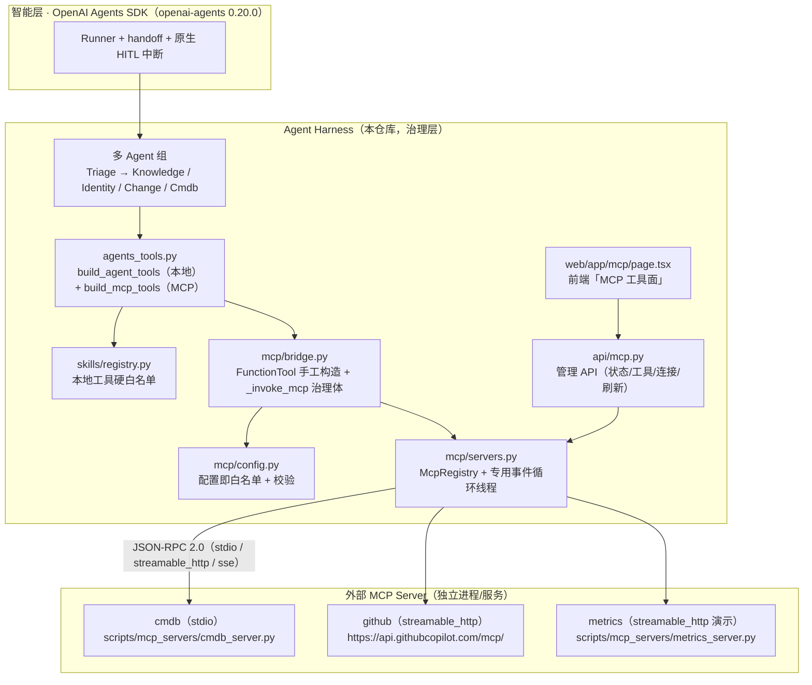

# MCP 接入设计（现行设计 · 连接 vs 治理）

> 状态：现行 · 最后校验：2026-08-18 · 校验方式：符号级 + 行为实测
> 一句话：**工具可以长在外部系统里（MCP），但能不能被调、由谁调、调完留什么痕，必须由 Harness 说了算**——MCP 解决「连接」，我们解决「治理」。
> 实现细节见 [03-MCP工具集成.md](../01-核心功能/03-MCP工具集成.md)；配置键见 [配置清单.md](../03-部署运维/配置清单.md) 第 10 节；面试话术见 [面试文档.md](../05-面试素材/面试文档.md)（8 大能力 · 工具层 MCP 行）。
> 历史提案（M5 之前的「设计样例」，与实现存在出入）见 [99-归档/MCP集成设计方案.md](../99-归档/MCP集成设计方案.md)；本文档描述 **M5（P0/P1/P2）完成后的当前真实实现**。

---

## 1. 背景与动机：为什么 MCP

### 1.1 项目原有的工具面（MPC-Skill 自研层）

M5 之前，本项目工具面是写死在仓库里的私有代码：

```
app/skills/registry.py   ← 硬编码白名单注册表（register_tool：name/risk/roles/description）
app/skills/*.py          ← 工具实现（grant/user_dir/kb），业务逻辑内嵌在代码里
app/agents_tools.py      ← 包装成 SDK function_tool，统一治理：预算/去重/tool_calls/trace/事件
app/agents_defs.py       ← 按职责分给 4 个 Agent（Triage + Knowledge/Identity/Change）
```

**差距**：真实企业里工具往往长在别的团队/别的系统（CMDB、监控平台、OA、数据库）——靠「fork 代码进来注册」不可扩展。

### 1.2 MCP 的价值：工具外置、治理不外包

MCP（Model Context Protocol，Anthropic 2024-11 开源的开放标准）把「LLM 应用 ↔ 外部工具/数据源」的对接收敛为 **JSON-RPC 2.0 的 M×1 通用连接**：任何 MCP Server（GitHub、数据库、CMDB、工单系统……）只需实现一次协议，任何 MCP Client 都能直接使用其工具。

本项目只做一件事的延伸：**工具实现可以外置到独立的 MCP Server 进程/服务，Harness 只保留「治理壳」**——这正是「执行权交给确定性的流程与治理」叙事的自然延伸。

### 1.3 面试金句

> 「工具可以长在外部系统里（MCP），但工具能不能被调、由谁调、调完留什么痕，必须由我们的 Harness 说了算——**MCP 解决『连接』，我们解决『治理』**。」

完整讲法见 [面试文档.md](../05-面试素材/面试文档.md)（工具层 MCP 一行，证据点对齐 `skills/registry.py`/`masker.py`/`grant.py`）。

---

## 2. 设计原则（红线）

| # | 原则 | 落地（当前实现） |
|---|---|---|
| R1 | **MCP 工具绝不绕过现有治理** | 所有 MCP 工具调用走 `app/mcp/bridge.py:_invoke_mcp` 治理体（预算/去重/落库/trace/事件/脱敏），与本地工具 `agents_tools._run` 同构 |
| R2 | **动态工具也要白名单** | Server 暴露的工具不能自动全量放行；`mcp_servers.json` 的 `tools` 映射表显式声明（工具名 → risk/roles），**未声明 = 拒绝**；SDK 层再挂 `create_static_tool_filter` 兜底（防御纵深） |
| R3 | **工具命名全局唯一** | 装配后统一 `{server}__{tool}`（如 `cmdb__query_asset`），与本地工具不冲突、Trace 可溯源（`app/mcp/bridge.py:split_tool_name`） |
| R4 | **双链路一致** | SDK 主链路（FunctionTool 直挂 Agent）与降级链路（传统 LLMGateway 按 registry 执行）都能消费 MCP 工具，行为一致；降级链路**只放行非 high 风险**工具 |
| R5 | **外挂优先、本地兜底** | 连接失败/超时只把该 server 的工具降级为「不可用/错误返回」，绝不抛到 Agent 主流程 |
| R6 | **可观测** | trace 的 `context_source="mcp"`、工具名带 server 前缀；`tool_calls` 表、`ticket_events`、指标口径与本地工具一致 |

---

## 3. 总体架构



**接入点定位**：MCP 不是新的 Agent，也不是新的执行循环——它只是 `agents_tools` 之下、`skills/registry` 之侧的**第二种工具后端**。对上层（Agent 定义、Runner、审批、Trace）完全透明。

---

## 4. 配置即白名单（mcp_servers.json）

配置文件位于项目根目录 `mcp_servers.json`，由 `app/mcp/config.py:load_config` 读取并校验（工具映射白名单的**唯一事实源**）。**没有顶层 `enabled` 键**——总开关是环境变量 `MCP_ENABLED`（`app/config.py:136`，默认开；false 时工具不装配、管理端点返回空列表，行为回到 M4）；路径由 `MCP_CONFIG_PATH` 控制，默认 `mcp_servers.json`。

当前内置两个 server（全量映射见 `mcp_servers.json`）：

| server | transport | 连接参数 | 工具（risk） |
|---|---|---|---|
| `cmdb` | stdio | `command=.venv/bin/python` + `args=[scripts/mcp_servers/cmdb_server.py]`；`env={"CMDB_DATA": "${CMDB_DATA}"}`；`client_timeout_seconds: 5`、`max_retry_attempts: 1`、`call_timeout_seconds: 15` | `query_asset`（low）、`list_network_devices`（low）、`update_asset_owner`（high） |
| `github` | streamable_http | `url=https://api.githubcopilot.com/mcp/`；`headers={"Authorization": "Bearer ${GITHUB_MCP_TOKEN}"}`；`client_timeout_seconds: 10`、`call_timeout_seconds: 30` | `search_repositories`/`list_repositories`/`get_issue`/`get_issue_comments`（low）、`create_issue`（high） |

配置结构要点（真实文件缩写示例）：

```jsonc
{
  "servers": [{
    "name": "cmdb",
    "transport": "stdio",
    "command": ".venv/bin/python",
    "args": ["scripts/mcp_servers/cmdb_server.py"],
    "cwd": ".",
    "env": {"CMDB_DATA": "${CMDB_DATA}"},   // ${ENV} 运行时注入，明文不落 JSON
    "client_timeout_seconds": 5,
    "max_retry_attempts": 1,
    "call_timeout_seconds": 15,
    "tools": {
      "query_asset": {
        "risk": "low",                       // high → 装配为 needs_approval=True（HITL）
        "roles": ["employee", "operator", "admin"],
        "description": "查询 CMDB 服务器资产信息（只读）",
        "param_schema": {                    // JSON Schema 子集，additionalProperties:false 严格校验
          "type": "object", "required": ["hostname"],
          "properties": {"hostname": {"type": "string"}}
        }
      }
    }
  }]
}
```

设计要点（均为 `app/mcp/config.py` 已实现行为）：

- **`tools` 映射表 = 第二道白名单**（第一道是连接本身）。`list_tools` 拉到的工具清单与映射表取**交集**才可用；映射表里没写的工具，即便 Server 暴露了也拒绝装配（R2）。字段语义与 `skills/registry.Tool` 对齐（name/risk/roles/description）。
- **「未声明 = 拒绝」**：`tools` 映射表为空的对象直接校验失败（`_validate_server` 抛 `McpConfigError`）。
- **校验与容错**：transport ∈ (stdio, streamable_http, sse)、risk ∈ (low, medium, high)、roles ∈ (employee, operator, admin)、`param_schema` 仅允许 JSON Schema 子集（type/required/properties/enum，`additionalProperties` 默认 false）；单个坏 server 只跳过自己，**不拖垮其它 server 也不炸主流程**（R5）。
- **${ENV} 注入**：`headers`/`env` 中的 `${ENV_VAR}` 在加载时展开（`_expand_env`），密钥不落 JSON、不进 git；展开后为空的 env 键会被剔除（避免空 `CMDB_DATA` 被 cmdb server 当成当前目录）。
- **防任意命令**：stdio `command` 只允许仓库内相对路径或绝对路径，含 `..` 跨目录直接校验失败。
- **管理 API 展示脱敏**：`ServerConfig.redacted()` 只保留 headers/env 的键名，值一律 `***`。

---

## 5. 连接生命周期设计（app/mcp/servers.py）

### 5.1 懒连接

进程启动**不拉起任何 MCP server**（R5：外部依赖不能成为启动故障点）。`McpRegistry.get_connection`（`app/mcp/servers.py:get_connection`）首次被访问（装配工具或首次调用）时才 `connect + list_tools`；`unhealthy` 或显式 `refresh=True` 时自动重建。

### 5.2 专用存活事件循环线程（关键设计）

SDK 的 `MCPServer` 是 **async 长连接**：`connect()` 建立 session（stdio 拉起子进程）后，`list_tools()`/`call_tool()` 复用同一 session。而 Agent run 运行在线程池（无事件循环）——若每次 `asyncio.run()` 新建 loop，首次 connect 建立的 session 会因 loop 关闭而失效。

因此 `app/mcp/servers.py:_ThreadLoop` 维护**一个专用存活事件循环线程**（守护线程 `mcp-event-loop`，`run_forever`），所有 server 的 connect / list_tools / call_tool / cleanup 都经 `run_coroutine_threadsafe` + 超时提交到该 loop，session 跨调用存活。

### 5.3 超时 / 重试 / 健康检查

- **超时**：连接 setup 超时 = `call_timeout_seconds` + `client_timeout_seconds` + 5；单次工具调用超时 = `call_timeout_seconds`（未配则取 `settings.mcp_timeout_seconds`，env `MCP_TIMEOUT_SECONDS` 默认 15）。
- **重试**：`max_retry_attempts`（默认 1，配置化）；重试间保留旧连接对象，全部失败时先 `cleanup` 残留 server（防子进程泄漏），再标记 `healthy=False + error`。
- **健康检查**：`McpConnection.healthy/error` 记录每次连接结果；`status()` 输出状态快照供管理 API；`get_connection` 对 unhealthy 连接自动重建。
- **失败降级**：连接/调用失败只把该 server 的工具标记不可用，绝不抛到 Agent 主流程（工具级错误返回，见 §6）。

### 5.4 白名单双保险

构造 `MCPServer` 时统一挂 `create_static_tool_filter(allowed_tool_names=映射表)`（`app/mcp/servers.py:102`，SDK 层兜底）；`list_tools` 返回后再按映射表交集过滤一次（`servers.py:140-141`，本层兜底）——即使装配逻辑有 bug，SDK 侧也不会把未映射工具暴露给模型。

### 5.5 调用与结果解析

`McpRegistry.call_tool`（`servers.py:call_tool`）在专用 loop 上执行 `server.call_tool`，统一解析为 `{ok, data|error}`：优先 mcp 2.x 的 `is_error` / `structured_content`，退化到 content 文本块拼接（兼容 v1 风格，文本是合法 JSON 时解码）。超时返回「MCP 工具超时（>Ns）」错误。

### 5.6 stdio 命令解析与关闭清理

- `_resolve_runner`（`servers.py:_resolve_runner`）把 stdio `command` 解析为实际可执行路径，兼容本机（`.venv/bin/python`）与 Docker（示例 server 是纯 Python + mcp 包，`python*` 回退当前解释器 `sys.executable`）双环境。
- `disconnect_all()` 挂在 FastAPI lifespan 关闭钩子（`app/main.py:68-71`），应用关闭时清理全部 server，防止 stdio 子进程泄漏。

---

## 6. 治理桥接设计（app/mcp/bridge.py）

### 6.1 为什么不用 SDK 的 MCPUtil.get_function_tools 直接挂 Agent

直接挂载会绕过本地预算 / 去重 / tool_calls 落库 / 脱敏（tool_calls 只进 SDK 远端 trace）。因此用 SDK `FunctionTool` **手工构造**（`app/mcp/bridge.py:_make_function_tool`）：

- `name = f"{server}__{tool}"`（R3 全局唯一）；
- `params_json_schema` 直接取 MCPTool 的原始 JSON Schema（`input_schema`），`strict_json_schema=False`（MCP schema 未必 strict，不强转）；
- `needs_approval=(risk == "high")` → 复用 SDK 原生 HITL；
- `on_invoke_tool` 走本文件的治理执行体 `_invoke_mcp`。

### 6.2 on_invoke 治理链（与 agents_tools._run 同构）

`app/mcp/bridge.py:_invoke_mcp` 是治理执行体，与本地工具完全同权：

```
懒连接（失败 → 工具级错误，不抛治理异常）
  → 参数校验（validate_params + 映射表 param_schema，app/mcp/validate.py:validate_params）
  → 预算（budget.check，BudgetExceeded → 错误返回）
  → 幂等去重（is_duplicate，同指纹时间窗内已成功即拒绝）
  → MCP 调用（registry.call_tool，带 call_timeout）
  → 输出脱敏（_sanitize → skills.masker）
  → tool_calls 落库 + trace（context_source="mcp"）+ ticket_events
  → budget.consume_step
```

治理异常（预算触顶、重复动作、参数校验失败、工具执行失败）按既有语义记入 RunContext（`_record_tool_error`），由 agents_runner 在 SDK 之外按 M2 约定重新抛出——与本地工具 `_run` 的失败语义一致。

### 6.3 HITL 复用（零改动）

映射表 `risk=high` → `needs_approval=True` → 直接复用 SDK 原生中断 + 审批/恢复链路（`approvals` 表 + RunState 快照 + `resume_run`）。`cmdb__update_asset_owner` 与本地 `grant_db_readonly` 走**同一个审批台**。

### 6.4 脱敏

`_sanitize`（`bridge.py:_sanitize`）对敏感字段打码：`_SECRET_KEYS`（password/secret/token/api_key/credential/auth/key 等）走 `masker.mask_secret`，`_SENSITIVE_KEYS`（principal/user/owner/email/phone 等）走 `masker.mask_principal`，其余字段原样递归（避免把 hostname/ip 这类有用数据打坏）。

### 6.5 降级链路：只放行非 high

传统 LLMGateway 循环（`_plan_and_execute`）按「工具名 → registry」执行，因此把已映射的 MCP 工具注册为 registry 代理工具，让降级链路也能用 MCP（R4）：

- `ensure_proxies_registered`（`bridge.py:ensure_proxies_registered`，**不是**旧设计的 `register_mcp_proxies`）幂等注册：遍历映射表，**跳过 `risk == "high"` 的工具**（`bridge.py:328`）——高风险写操作强制走 SDK 链路的原生 HITL，文本降级链路不承担审批语义；
- 注册名沿用 `{server}__{tool}`，与本地工具在 tool_calls/trace 中一致；
- proxy 执行体 `_invoke_mcp_proxy`（`bridge.py:_invoke_mcp_proxy`）只做「参数校验 + 实际调用 + 脱敏」，治理（预算/去重/落库/trace/HITL）由降级链路 `_execute_tool` 统一承担，不重复；
- 接线点：`app/orchestrator.py:319-320` 在 assemble 构造 tools_allowed 之前调用。

### 6.6 装配入口

`build_mcp_tools(role, names)`（`bridge.py:build_mcp_tools`）：按角色 + 工具名过滤，只装配「映射表 ∩ server 实际暴露」的工具；角色不在映射表 `roles` 内的一律不装配；`settings.mcp_enabled` 关闭或 SDK 不可用时返回空列表。`app/agents_tools.py:199` 提供同名转发入口。

---

## 7. Agent 装配设计（app/agents_defs.py）

新增工具面只做加法，现有 4 个 Agent 逻辑不动：

| 工具集 | 工具 | 挂载 Agent | 说明 |
|---|---|---|---|
| `CMDB_TOOLS`（`agents_defs.py:29-30`） | `cmdb__query_asset` / `cmdb__list_network_devices` / `cmdb__update_asset_owner` | **CmdbAgent**（`agents_defs.py:70-75`） | CMDB 外部工具面；三工具全部挂 CmdbAgent（高风险写操作同样由 CmdbAgent 触发 HITL 审批） |
| `GITHUB_READ_TOOLS`（`agents_defs.py:33-34`） | `github__search_repositories` / `github__list_repositories` / `github__get_issue` / `github__get_issue_comments` | **KnowledgeAgent**（`agents_defs.py:55`：`kb_tools + github_ro`） | 只读外部信息检索 |
| `GITHUB_WRITE_TOOLS`（`agents_defs.py:35`） | `github__create_issue` | **ChangeAgent**（`agents_defs.py:67`：`ch_tools + github_wo`） | 写操作 high → HITL 审批 |

- 装配经 `at.build_mcp_tools(role, ...)`（`app/agents_tools.py:build_mcp_tools` → `app/mcp/bridge.py:build_mcp_tools`），与本地 `build_agent_tools` 并列；
- TriageAgent 新增 `transfer_to_cmdb_agent` handoff（`agents_defs.py:84`），其余 handoff 不变；
- 兜底/恢复用的 `AGENT_NAMES` 追加 `"cmdb"`（`agents_defs.py:92`）。

---

## 8. 管理 API 设计（app/api/mcp.py）

全部端点挂 `require_role("operator", "admin")`（`app/api/mcp.py`，挂载于 `app/main.py:82`）：

| 端点 | 函数 | 作用 |
|---|---|---|
| `GET /api/mcp/servers` | `servers`（`api/mcp.py:29`） | server 状态快照（healthy/error/已发现工具/脱敏配置），**不触发连接** |
| `GET /api/mcp/servers/{name}/tools` | `server_tools`（`api/mcp.py:37`） | 某 server 已发现工具 + 映射后的 risk/roles/描述（白名单语义展示） |
| `POST /api/mcp/servers/{name}/connect` | `connect`（`api/mcp.py:61`） | 手动预连 / 断后重连（`get_connection(refresh=True)`） |
| `POST /api/mcp/servers/{name}/disconnect` | `disconnect`（`api/mcp.py:93`） | 断开并清理（故障演练：断开 cmdb → 优雅降级 → connect 恢复） |
| `POST /api/mcp/servers/{name}/refresh` | `refresh`（`api/mcp.py:76`） | 工具清单/配置热刷新：重建连接 + 重拉 list_tools（P2） |

远程 server（streamable_http/sse）连接失败时，`_remote_hint` 提示「该 server 是远程服务，需先独立启动」以区分 stdio 自动拉起。前端「MCP 工具面」页面（`web/app/mcp/page.tsx`，P2）一屏展示 server 状态 / transport / 已发现工具 / 映射后的 risk·roles·param_schema·描述，支持连接 / 断开 / 刷新。

---

## 9. 与 MPC-Skill 的分工（连接 vs 治理）

| 维度 | MPC-Skill（本地工具） | MCP（外部工具） |
|---|---|---|
| 工具实现位置 | 写死在本仓库（`app/skills/*.py`） | 外置到独立 MCP Server 进程/服务 |
| 白名单来源 | `skills/registry.py` 硬编码注册表 | `mcp_servers.json` 映射表（未声明 = 拒绝） |
| 装配入口 | `agents_tools.build_agent_tools` → `_run` | `agents_tools.build_mcp_tools` → `bridge._invoke_mcp` |
| 治理语义 | 预算/去重/落库/trace/事件/脱敏/HITL | **与本地完全同权**（`_invoke_mcp` 与 `_run` 同构） |
| 降级链路 | registry 原生可用 | 经 `ensure_proxies_registered` 注册为 registry 代理（只放行非 high） |

一句话分工：**MCP 解决「连接」，我们解决「治理」**——工具实现可以外包，治理不能外包。

---

## 10. 与旧设计提案的出入修正（本文档描述当前真实实现）

旧提案 `docs/99-归档/MCP集成设计方案.md`（历史记录，非现行事实）中的「设计样例」与当前实现存在以下出入，本文档一律按实现写：

| 旧设计提案 | 当前真实实现 |
|---|---|
| 顶层 `enabled: true` 键 | **无顶层 enabled 键**；总开关是 env `MCP_ENABLED`（`app/config.py:136`） |
| cmdb env 字面 `{"CMDB_DATA": "data/cmdb.json"}` | `${CMDB_DATA}` 运行时注入（`mcp_servers.json:9`），未设置时 cmdb server 回退默认 `data/cmdb.json` |
| cmdb `client_timeout_seconds: 30` | `client_timeout_seconds: 5` + 新增 `call_timeout_seconds: 15`（`mcp_servers.json:10-12`） |
| 内置远程 server 为 gitlab | 内置 server 为 **github**（streamable_http，`https://api.githubcopilot.com/mcp/`，Bearer `${GITHUB_MCP_TOKEN}`） |
| env 键 `MCP_CONNECT_TIMEOUT` | `MCP_TIMEOUT_SECONDS=15`（`.env.example`），ServerConfig 可 per-server 覆盖 |
| `update_asset_owner` 挂 ChangeAgent | cmdb 3 工具**全部挂 CmdbAgent**（`agents_defs.py:29-30`、`70-75`）；github 只读 4 工具挂 KnowledgeAgent、`create_issue` 挂 ChangeAgent（`agents_defs.py:33-35`、`52-68`） |
| 降级函数名 `register_mcp_proxies` | `ensure_proxies_registered`（`app/mcp/bridge.py:316`），且在 `app/orchestrator.py:319-320` 接线 |
| 示例 server 用 FastMCP（`mcp.server.fastmcp`） | mcp 2.x 已移除 FastMCP；用 `MCPServer` API（`@server.tool()` + `run_stdio_async`，见 `scripts/mcp_servers/cmdb_server.py`）；`mcp==2.0.0`（`requirements.txt:16`） |
| 管理 API 无 refresh | 新增 `POST /api/mcp/servers/{name}/refresh`（`app/api/mcp.py:75`） |
| 前端 MCP 页面列「第二期」 | P2 已完成：`web/app/mcp/page.tsx`（连接/断开/刷新 + 映射展示） |

---

## 11. 已知边界与 Roadmap

- **OAuth 授权码流未实现**：鉴权仅静态 Bearer（demo 语义）。OAuth 2 授权码流留给真实远程 server——SDK 对 SSE/OAuth 原生支持，`mcp_servers.json` 的 config 已可传 headers/token。
- **sse 传输**：配置层与 `servers.py` 已支持 `sse` 的 url + headers（`MCPServerSse`），但 `mcp_servers.json` 未单列一个 sse 示例 server（与 streamable_http 演示等价，视需要再加）。
- **github 公共 server 依赖 token**：需在 `.env` 填 `GITHUB_MCP_TOKEN`（PAT，见 `.env.example` 注释）；未配置时连接 401——`scripts/smoke_mcp_http.py` 的 Bearer 401 断言覆盖该路径。
- **metrics 演示 server 不在默认配置内**：`scripts/mcp_servers/metrics_server.py` 是自起演示（streamable_http + Bearer，业务鉴权由一层 ASGI 中间件承担）；`smoke_mcp_http.py` 自造 ServerConfig 验证远程链路，不依赖 `mcp_servers.json`。
- **高风险 HITL 真模型端到端属 best-effort**：依赖模型「自愿调用高风险工具」的行为（`scripts/smoke_mcp.py`）；HITL 机制的确定性证据由装配层 `needs_approval=True` 断言 + 本地高风险工具同一 SDK 原生审批/恢复链路覆盖。
- **前端工具清单刷新为手动**：`refresh` 端点/按钮按需触发；若需更高频自动同步，可在页面轮询时透传 refresh。
- **顺带修复的既有 bug**：M5 治理验证中发现 `app/guards.py:is_duplicate` 时间窗比较此前永不命中（SQLite UTC/空格分隔 vs 本地时区 isoformat），修后本地与 MCP 工具同受益。

---

## 12. 演进记录（M5：P0 / P1 / P2 已完成）

完成时间线与验收细节见 [里程碑-M1至M5.md](../99-归档/里程碑-M1至M5.md)，此处仅记录演进主线：

| 阶段 | 内容 | 产物 |
|---|---|---|
| **P0 最小闭环** | 配置 + 连接 + 桥接 + 装配 + 示例 server | `app/mcp/config.py` / `servers.py` / `bridge.py`、`CmdbAgent`、`scripts/mcp_servers/cmdb_server.py`、`scripts/smoke_mcp.py` |
| **P1 治理完善** | 参数校验、降级链路贯通、超时/重试/健康检查、管理端点 | `app/mcp/validate.py`、`ensure_proxies_registered` + `app/orchestrator.py` 接线、`/api/mcp` 端点 |
| **P2 生态增强** | 远程 server + Bearer、热刷新、前端页面、公共 github server | `scripts/mcp_servers/metrics_server.py`、`scripts/smoke_mcp_http.py`、`refresh` 端点、`web/app/mcp/page.tsx`、`mcp_servers.json` 内置 github |

验证命令（行为实测入口）：

```bash
python scripts/smoke_mcp_core.py     # 确定性冒烟：连接/白名单/治理/审计/脱敏/预算/管理 API
python scripts/smoke_mcp_http.py     # P2 streamable_http 链路（Bearer 401/工具调用/审计/重连）
python scripts/smoke_mcp.py          # 真模型端到端（需 OpenRouter key，高风险场景 best-effort）
python scripts/diag_mcp_stdio.py     # stdio 拉起失败真因诊断
```
