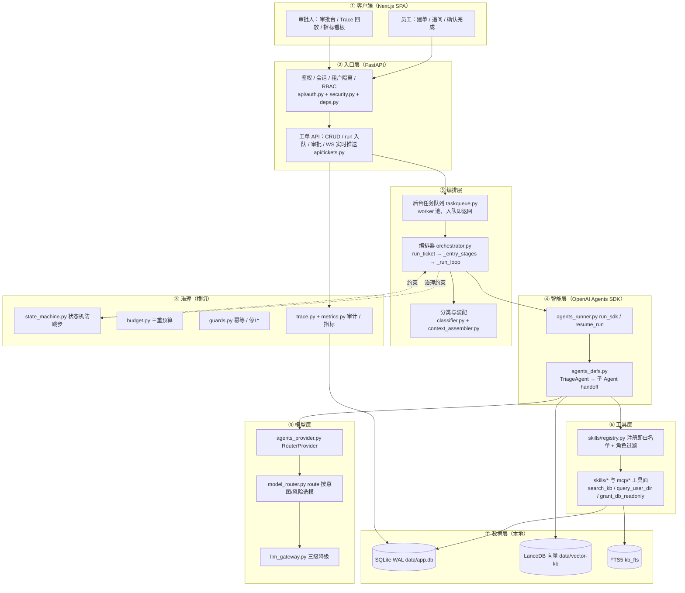

# 架构总览与分层

> 状态：现行 · 最后校验：2026-08-18 · 校验方式：符号级 + 行为实测
> 本页是 `docs/02-架构设计/` 的**总览**：只讲分层边界与设计决策，不重复实现细节。
> 能力 → 代码符号级映射见 [能力-代码映射表.md](../01-核心功能/06-能力-代码映射表.md)；功能实现（怎么用、配置、API）详见 `docs/01-核心功能/` 各篇： [02-RAG知识库.md](../01-核心功能/02-RAG知识库.md) · [03-MCP工具集成.md](../01-核心功能/03-MCP工具集成.md) · [04-高并发架构.md](../01-核心功能/04-高并发架构.md) · [05-可观测性与审计.md](../01-核心功能/05-可观测性与审计.md)。
> 参考的 v4 旧版 `docs/开发文档.md` 第 3 章与根 `README.md` 架构图已过时（「SSE 事件流」实为 WebSocket、「4 个 Agent」实为 5 个、「同步 run」实为入队即返回），本页一律以当前代码为准。

---

## 1. 分层总览



一句话：**大模型只负责「判断下一步」，执行权交给确定性的流程、权限与审批**；LLM 循环用官方 OpenAI Agents SDK，企业治理（状态机/预算/守卫/审批/Trace）全部自研并落 SQLite。

---

## 2. 每层职责与关键模块

| 层 | 职责 | 关键模块 | 关键函数 |
|---|---|---|---|
| ① 客户端 | 建单/追问/确认完成、审批操作、Trace 回放与指标看板 | Next.js 前端（SPA，经 WS + 轮询取事件） | — |
| ② 入口层 | 登录/会话/租户隔离/RBAC；工单 CRUD；run/追问/审批**入队即返回**；WS 实时推送；治理查询 | `app/main.py`、`app/api/auth.py`、`app/api/tickets.py`、`app/api/governance.py`、`app/security.py`、`app/deps.py` | `app/security.py:hash_password`、`app/security.py:create_session`、`app/security.py:resolve_token`、`app/deps.py:current_user`、`app/deps.py:require_role`、`app/api/tickets.py:create_ticket`、`app/api/tickets.py:run`、`app/api/tickets.py:ws_events` |
| ③ 编排层 | 快速落单 stage 流水线；状态机推进；上下文装配；LOOP 调度与 HITL 恢复；回合收敛落账 | `app/orchestrator.py`、`app/classifier.py`、`app/context_assembler.py`、`app/taskqueue.py` | `app/orchestrator.py:run_ticket`、`app/orchestrator.py:_entry_stages`、`app/orchestrator.py:_run_loop`、`app/orchestrator.py:resume_ticket`、`app/orchestrator.py:_finalize_round`、`app/classifier.py:relevance_check`、`app/classifier.py:rewrite_content`、`app/classifier.py:classify`、`app/context_assembler.py:assemble`、`app/taskqueue.py:submit_ticket_job` |
| ④ 智能层 | SDK `Agent + Runner` 计划-工具循环；多 Agent handoff；原生 HITL 中断与 `RunState` 恢复 | `app/agents_runner.py`、`app/agents_defs.py`、`app/agents_tools.py`、`app/agents_trace.py` | `app/agents_runner.py:run_sdk`、`app/agents_runner.py:resume_run`、`app/agents_defs.py:build_agent_group`、`app/agents_trace.py:install` |
| ⑤ 模型层 | 意图/风险 → 模型路由；OpenRouter 主 → Ollama 兜底 → 离线 reader 三级降级；SDK 模型提供方 | `app/model_router.py`、`app/llm_gateway.py`、`app/agents_provider.py` | `app/model_router.py:route`、`app/llm_gateway.py:chat_with_fallback`、`app/agents_provider.py:RouterProvider` |
| ⑥ 工具层 | 注册即白名单；角色过滤；参数强校验/脱敏；知识库/用户目录/授权变更/MCP 外部工具 | `app/skills/registry.py`、`app/skills/*`、`app/mcp/*` | `app/skills/registry.py:register_tool`、`app/skills/registry.py:tools_for_role`、`app/skills/kb.py:search_kb`、`app/skills/user_dir.py:query_user_dir`、`app/skills/grant.py:grant_db_readonly` |
| ⑦ 数据层 | SQLite(WAL)+FTS5 主存储；LanceDB 向量检索；rerank 精排；DAO 单一写入口 | `app/db.py`、`app/daos/*`、`app/kb.py`、`app/vector_kb.py`、`app/rerank.py` | `app/db.py:init_db`、`app/daos/tickets.py:transition`、`app/kb.py:search`、`app/rerank.py:rerank` |
| ⑧ 治理（横切） | 状态机防跳步；三重预算；幂等/停止守卫；Trace/指标落库 | `app/state_machine.py`、`app/budget.py`、`app/guards.py`、`app/trace.py`、`app/metrics.py` | `app/state_machine.py:can_transition`、`app/budget.py:Budget`、`app/guards.py:is_duplicate`、`app/guards.py:should_stop`、`app/trace.py:write`、`app/metrics.py:record` |

> 注：SDK 路径与降级路径共用同一套治理约束——SDK 工具经 `app/agents_tools.py` 执行时逐项核查，传统路径 `app/orchestrator.py:_execute_tool` 再做一遍（双保险）。

---

## 3. 一次工单请求的全链路时序

```
建单 → run 入队(queued) → worker 执行 run_ticket → _entry_stages(相关/重写/分类)
  → created→triaged→gathering → 装配+路由 → agent_running → run_sdk(handoff+工具循环)
  → [高风险 → awaiting_approval → approve → resume_run] → pending_confirm → confirm → done
  → traces / metrics 落库，WS 全程增量推送
```

1. **建单（毫秒级，不做同步 LLM 校验）**：`POST /api/tickets` → `app/api/tickets.py:create_ticket` → `app/daos/tickets.py:create_ticket` 落 tickets（status=`created`）并写 `created` 事件；前端进入聊天页后触发 run，各阶段以 `stage` 事件在聊天内流式展示。
2. **入队**：`POST /api/tickets/{id}/run` → `app/api/tickets.py:run`：仅 `created` 可触发（否则 409）；`app/taskqueue.py:try_acquire` 取每工单互斥锁（防双跑）→ `app/taskqueue.py:submit_ticket_job(ticket_id, run_ticket, …)` 入 worker 池，**立即返回 `{"status":"queued"}`**。
3. **worker 执行**：worker 池调用 `app/orchestrator.py:run_ticket` → `_run_loop`。
4. **快速落单首轮 `_entry_stages`**（仅 `created`）：`classifier.relevance_check`（不相关 → 置 `cancelled` + system_message 拒绝文案）→ `classifier.rewrite_content`（落 `rewrite` 事件，执行阶段复用为目标）→ `classifier.classify`（`app/daos/tickets.py:update_ticket_meta` 回写 risk/intent）；每步发 `stage` 事件（running/ok/fail）。
5. **状态推进**：`app/daos/tickets.py:transition` 走 `created→triaged→gathering`，每次写 `state_transition` 事件；`app/state_machine.py:can_transition` 校验，非法抛 `InvalidTransition`（禁止跳步）。
6. **装配与路由**：`app/model_router.py:route` 按 (intent, risk) 选模（高风险升格强模型）→ `app/context_assembler.py:assemble` 装配 goal/history/memo/tools/budget（选/压/截）→ `app/budget.py:Budget.start_for` → `daos.transition` `gathering→agent_running`。
7. **SDK 计划-工具循环**：`app/agents_runner.py:run_sdk` → `app/agents_defs.py:build_agent_group` 组装 TriageAgent + 4 个子 Agent（Knowledge/Identity/Change/CmdbAgent，`transfer_to_*` handoff）→ `Runner.run_sync(max_turns=budget.max_steps)`；模型经 `app/agents_provider.py:RouterProvider`（`openrouter:`/`ollama:` 前缀路由）；SDK 不可用（`SdkUnavailable`）→ 降级 `app/orchestrator.py:_plan_and_execute` 传统 LLM 网关循环。
8. **工具调用**：SDK function_tool → `app/agents_tools.py`（白名单/RBAC/预算/去重/脱敏/`daos.record_tool_call` 落库）；传统路径 `app/orchestrator.py:_execute_tool` 执行同一套守卫。
9. **HITL 中断**：高风险工具 `needs_approval=True` → SDK 原生 interruption（`ToolApprovalItem`）→ `agents_runner._handle_interruptions`：`daos.request_approval` 落审批单 + `daos.save_run_state`（RunState 快照，跨重启恢复）+ 内存 `_PENDING` → orchestrator 转 `awaiting_approval` + `_record_metrics(human_takeover=True)`。
10. **审批恢复**：`POST /api/tickets/{id}/approve` → `app/api/tickets.py:approve` → `daos.decide_approval` → `submit_ticket_job(resume_ticket, …)` → `app/orchestrator.py:resume_ticket` → `app/agents_runner.py:resume_run`（内存热路径或 `_resume_from_db` 跨进程）→ `_finalize_after_sdk_resume`：`_walk_transitions` 走 `gathering→agent_running→pending_confirm` 完整路径 + 收敛写账。
11. **收敛**：无中断 → `agents_runner._handle_done` 写 final trace → `daos.transition` `agent_running→pending_confirm`（**终态由人确认，不由模型自封**）→ `deliver` 事件 → `_finalize_round`/`_finalize_write`（回写 tickets 预算列/prompt_version/trace_req_id/final_answer + `daos.append_memory` 长期记忆）→ `_record_metrics(success=True)`。
12. **客户确认**：`POST /api/tickets/{id}/confirm` → `app/api/tickets.py:confirm` → `daos.transition` `pending_confirm→done` + `confirmed` 事件；之后可归档（close → `archived`）。多轮追问：`pending_confirm`/`failed` 状态下 `POST /api/tickets/{id}/messages` → `app/api/tickets.py:followup`（追加相关性校验）→ 回 `gathering` 开新一轮。
13. **Trace/指标落库**：每次模型/工具调用 `app/trace.py:write` 落 traces 表；SDK 顶层 Trace 由 `app/agents_trace.py:LocalTraceProcessor`（`install()` 在 orchestrator 导入时挂载，把 SDK trace 重定向到本地 SQLite）转存同表；`app/metrics.py:record` 落 metrics（success/correct_failure/human_takeover/latency/cost）。
14. **实时通道**：`app/api/tickets.py:ws_events`（WS `/api/tickets/{id}/ws`，先回放已有事件再 0.3s 增量推送）；SSE 端点 `events` 已 `[deprecated]`（保留仅兼容 EventSource/旧客户端）。

---

## 4. 设计决策与取舍

| # | 决策 | 现状（已核实） | 为什么 |
|---|---|---|---|
| 1 | **自研状态机而非 LangGraph** | 转移表 `app/state_machine.py` + 乐观锁 `app/daos/tickets.py:transition`（`UPDATE ... WHERE status=?`） | 简单、可逐行讲解；HITL 中断/恢复原理（`resume_ticket`/`resume_run`）完全可控；状态外部化到 SQLite，进程重启/多副本不丢。框架黑盒 checkpoint/interrupt 反而讲不清。 |
| 2 | **SDK 管 LOOP，治理自研** | 智能层用 OpenAI Agents SDK（Agent+Runner、handoff、原生 interruptions、RunState 恢复）；治理（状态机/预算/守卫/审批持久化/Trace/指标）全部自研 | 工具循环/多 Agent 是 SDK 成熟能力不重复造轮子；「可靠/可控/可审计」必须自己掌控，且每条链路可审计、可回放。 |
| 3 | **SQLite 而非 PG** | `data/app.db`，WAL + `busy_timeout=5000` + `synchronous=NORMAL`；FTS5 与业务同源 | 单机 0 成本、状态外部化、审计可回放；配乐观锁 + 每工单互斥锁 + worker 池（`AGENT_WORKERS=4`）封顶并发。阶段 2 再迁 PG 解决写并发。 |
| 4 | **单机部署边界** | run/追问/审批入队即返回（`app/taskqueue.py`）；LLM 并发闸门（`AGENT_LLM_CONCURRENCY`）+ 单请求超时（`AGENT_LLM_TIMEOUT`） | 长任务不再占 HTTP 线程；慢响应不雪崩到降级链；架构上不欠债——换 PG + Redis + 独立 worker 服务即可平滑升级。 |
| 5 | **WS 而非纯轮询/SSE** | WS `/api/tickets/{id}/ws`（拉模式 0.3s 增量）；SSE 端点 deprecated；前端另有轮询兜底 | 事件先回放再增量，断线重连友好；SSE 长轮询占用连接且实现复杂，仅保留兼容。 |
| 6 | **快速落单（P0）** | 建单不做同步 LLM 校验（立即返回 ticket_id）；相关性/重写/分类移入 run 首轮 `_entry_stages`，以 `stage` 事件流式展示 | 建单毫秒级、入口不被 LLM 拖垮；拒绝/分级结果仍全程可审计。 |
| 7 | **工具双保险** | SDK 工具执行 `app/agents_tools.py` 逐项核查；传统降级路径 `app/orchestrator.py:_execute_tool` 同套守卫；MCP 工具同样过映射表风险/权限 | 无论走哪条链路，白名单/RBAC/预算/去重/脱敏/审计都不缺位。 |

---

## 5. 数据模型速览

表结构来自 `app/db.py` 的 `SCHEMA`（建表语句 + `_migrate` 增量列），已逐表核实：

| 载体 | 内容 | 关键点 |
|---|---|---|
| SQLite `data/app.db`（WAL） | `tenants` / `users` / `sessions` / `tickets` / `ticket_events` / `tool_calls` / `approvals` / `traces` / `memory` / `kb_documents` / `metrics` / `grants` + FTS5 虚拟表 `kb_fts` | 全部外键 + 审计可回放 |
| LanceDB `data/vector-kb/kb_chunks.lance` | 知识库向量索引（表 `kb_chunks`，见 `app/vector_kb.py`） | embedding 主 OpenRouter → 兜底 Ollama；不可用优雅降级关键词路 |
| 文件系统 | `logs/` 函数级日志（`LOG_DIR`）；`data/` 下上传的知识库文档原件 | `app/tracelog.py` |

各表职责（SQLite）：

| 表 | 职责 | 写入入口（已核实） |
|---|---|---|
| `tickets` | 工单主表：risk/intent/status/priority + 迁移列 `budget_used_tokens`/`budget_used_seconds`/`prompt_version`/`trace_req_id`/`final_answer` | `app/daos/tickets.py:create_ticket`、`_finalize_write` |
| `ticket_events` | 全量事件流（`state_transition`/`stage`/`rewrite`/`model_call`/`tool_call`/`deliver`/`hitl`/`user_message`/`confirmed`…），WS 推送来源 | `app/daos/tickets.py:add_event`、`transition` |
| `traces` | 每次模型/工具调用审计：`io_json`/`state_before`/`state_after`/`latency_ms`/`token_usage_json` | `app/trace.py:write`（SDK 顶层 Trace 经 `app/agents_trace.py:LocalTraceProcessor` 转存） |
| `metrics` | 按日聚合：success/correct_failure/human_takeover/latency/cost | `app/metrics.py:record` |
| `approvals` | HITL 审批单 + 迁移列 `run_state_json`/`routing_json`/`run_ctx_json`/`budget_json`/`req_id`/`raw_item_json`（跨进程恢复 RunState） | `app/daos/approvals.py:request`、`decide`、`save_run_state` |
| `tool_calls` | 工具调用与幂等键 `idempotency_key`（`app/guards.py:is_duplicate` 查重） | `app/daos/tool_calls.py:record` |
| `sessions` / `users` | 会话 token 哈希 / 账户角色（RBAC：employee/operator/admin） | `app/security.py:create_session` |
| `memory` | 租户长期记忆（key=`preferences`，每轮收敛追加，每键最多保留 10 条） | `app/daos/memory.py:append`、`latest` |
| `kb_documents` | 知识库文档权威源（`kb_fts` 与向量索引从它维护/重建） | `app/kb.py:add_document`、`seed_kb` |
| `grants` | 授权变更审计（grant/revoke 状态持久化，非内存态） | `app/skills/grant.py` |

> 与 README「记忆五分层」的对应：Session → `sessions`/`users`；Task State → `tickets`+`ticket_events`；Memory 长期 → `memory` 表；Artifact 产物 → 上下文模板 `<artifacts>` 段 + `kb_documents`/上传文件；Trace 审计 → `traces` 表（不落文件）。

---

## 6. 演进边界

当前单机方案的核心判断是「**长任务不占请求线程**」已做对（见 [04-高并发架构.md](../01-核心功能/04-高并发架构.md) 阶段 1 五项整改）；阶段 2/3 方向（PostgreSQL 写并发、Redis 缓存/分布式锁/审批状态、Agent 独立 worker 服务、JWT/SSO、K8s 化与消息队列）一句话指向 [高并发与部署架构.md](高并发与部署架构.md)，升级路径不欠债。

---

## 附：本目录文档地图

| 文档 | 内容 |
|---|---|
| 本页 架构总览与分层.md | 分层边界、全链路时序、设计决策、数据模型速览 |
| [状态机设计.md](状态机设计.md) | 状态全集、转移表、持久化与并发安全 |
| [治理层设计.md](治理层设计.md) | 预算 / 守卫 / 工具白名单 / HITL / 幂等 |
| [RAG检索链路设计.md](RAG检索链路设计.md) | 混合检索选型与权衡（向量+FTS+RRF+rerank） |
| [高并发与部署架构.md](高并发与部署架构.md) | 单机并发模型与阶段 2/3 路线图 |
| [能力-代码映射表.md](../01-核心功能/06-能力-代码映射表.md) | 能力 → 代码模块 → 函数 符号级映射（`scripts/check_docs.py` 专项校验） |
