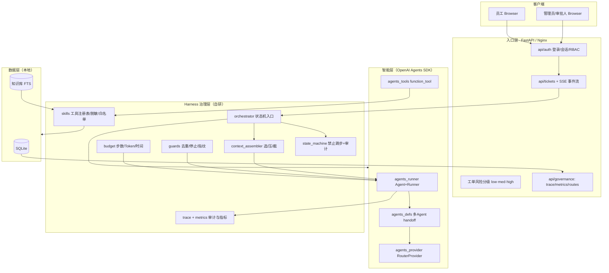
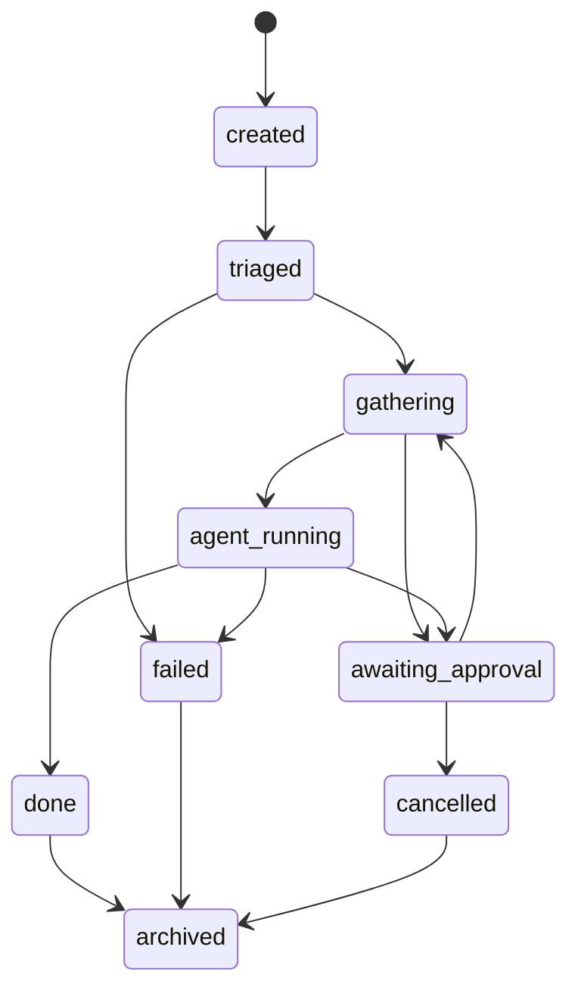

> **历史记录，非现行事实** · v4 文档（对齐 M1–M4），代码已演进至 M5+高并发加固；内容已拆分升级至 [00-项目概览](../00-项目概览/) [01-核心功能](../01-核心功能/) [02-架构设计](../02-架构设计/)。

# 企业级混合 Agent 工作流 Demo —— 开发文档（v4，对齐当前代码）

> 本文档**逐行对齐仓库当前真实实现**（含 M1–M4 演进，M4 起引入 OpenAI Agents SDK）。
> 对应阶段说明：`M1_README.md` · `M2_README.md` · `M3_README.md` · `M4_README.md`；
> 讲解讲稿见现行指南（[docs/README.md](../../docs/README.md) 文档中心）；开场一张图见 `README.md`。

---

## 1. 项目总览

### 1.1 一句话定位

一个运行在单机上的**企业 IT 工单智能处理系统**，用来完整展示「企业级 Agent Harness」的工程能力：
不是演示「AI 多聪明」，而是演示「**AI 如何被可靠、可控、可审计地接进企业业务**」。系统把大模型当作「判断层」，把执行权交给确定性的流程、权限与审批。

### 1.2 架构核心：自研治理层 + OpenAI Agents SDK

系统分两部分，边界清晰：

- **治理层（自研，Harness）**：状态机、预算、守卫、审批持久化、Trace、指标、工具白名单/脱敏。这是「可靠 / 可控 / 可审计」的落地，全部由本项目自己掌控。
- **智能层（OpenAI Agents SDK）**：`Agent + Runner.run_sync` 跑模型驱动的「计划 → 工具调用」循环，支持多 Agent handoff 编排、原生 interruptions（HITL）。这是 SDK 擅长且成熟的部分，不重复造轮子。

一句话：**LLM 循环用官方 SDK，企业治理保留自研** —— 既拿到 SDK 的多 Agent 编排能力，又守住确定性流程。

### 1.3 IT 工单特点

- 天然存在**风险分级**：查知识库 / 查用户是低-中风险只读操作，可直接执行；开通/回收权限是高危操作，必须 HITL 审批。
- 天然长得出**工具面**：只读查询 vs 变更执行，正好演示「最小权限 + 硬编码白名单 + 参数强校验 + 脱敏 + 审计」。
- 与「AI 开发工程师」岗位叙事契合：研发团队自己就能理解、能代入。

### 1.4 扮演的角色（三档模型）

| 角色 | 说明 | 可见工具 |
|---|---|---|
| `employee` | 普通员工，建单/查询 | 只读：`search_kb` `search_kb_direct` `query_user_dir` |
| `operator` | 运维，可执行变更 | 全部（含高风险变更工具） |
| `admin` | 管理员，可执行变更/审批 | 全部 |

工具按角色过滤（`skills/registry.py` + `agents_tools.build_agent_tools`），RBAC 在工具层真正生效。

---

## 2. 技术栈

| 层 | 选型 | 说明 |
|---|---|---|
| 后端 | Python + FastAPI | 轻量、结构化、可逐行讲解 |
| 智能编排 | **OpenAI Agents SDK**（`openai-agents`） | `Agent+Runner` 工具循环、多 Agent handoff、原生 interruptions |
| 模型 | **OpenRouter 主 ⇄ Ollama 兜底**（均 OpenAI Chat Completions 兼容） | `RouterProvider` 按模型名前缀路由 |
| 治理 | 自研状态机 + 预算 + 守卫 + 审批 + Trace + 指标 | 确定性流程，防跳步/越权/跑飞 |
| 存储 | SQLite（WAL）+ 文件系统 | 单机、0 成本、状态外部化、审计可回放 |
| 前端 | Next.js 14（App Router，纯客户端 SPA） | 工单台 / 审批台 / Trace / 指标 |
| 部署 | Docker Compose + Nginx | 单台 Ubuntu 零成本上线 |

依赖（`requirements.txt`）：`fastapi` `uvicorn` `pydantic` `httpx` `python-dotenv` `openai>=1.40` `openai-agents>=0.0.9`。

> 版本注意：当前环境装到 `openai-agents 0.20.0`。该版本的几个 API 细节均已在本项目适配：
> `RunConfig` 无 `max_turns`（改用 `Runner.run_sync(..., max_turns=)`）；`function_tool` 用 `name_override`/`description_override`；`TracingProcessor` 是 6 方法 ABC；`RunState.from_json` 为 async。

---

## 3. 系统架构

### 3.1 总体数据流



### 3.2 一层层拆解

- **入口**：`app/api/auth.py` 登录（PBKDF2 密码哈希 + 会话 token）；`app/api/tickets.py` 建单/查单/运行/审批/SSE；`app/api/governance.py` trace/metrics/模型路由查询。
- **编排入口**：`app/orchestrator.py` 的 `run_ticket` → `_run_loop`：推进状态机（`created→triaged→gathering→agent_running`），SDK 可用时委托 `agents_runner.run_sdk`，否则用 `llm_gateway` 传统循环（离线 `reader` 可演示）。
- **智能循环**：`agents_runner.run_sdk` 拉起 `TriageAgent` → handoff 到对应子 Agent → SDK 自动跑工具循环。
- **治理**：每步工具调用由 `agents_tools._run` 做白名单/RBAC/预算/去重/脱敏/记录，高风险走 SDK 原生中断（HITL）。

### 3.3 为什么不用 LangGraph 这类通用编排框架

- LLM 的**工具循环/多 Agent handoff 是 OpenAI Agents SDK 成熟且标准的能力**，直接用。
- 但**企业治理层**（状态机、审批持久化、预算、Trace）如果交给框架的黑盒（如 LangGraph 的 checkpoint/interrupt），很难讲清「HITL 怎么中断、怎么恢复」。所以治理保留自研、数据全落 SQLite，每一行都能讲出「为什么这样设计」。

---

## 4. 工单状态机（`app/state_machine.py`）

```python
TRANSITIONS = {
    "created":          {"triaged"},
    "triaged":          {"gathering", "failed"},
    "gathering":        {"agent_running", "awaiting_approval", "failed", "cancelled"},
    "agent_running":    {"gathering", "awaiting_approval", "done", "failed", "cancelled"},
    "awaiting_approval": {"running", "gathering", "cancelled", "failed"},
    "running":          {"done", "failed", "cancelled"},
    "done":             {"archived"},
    "failed":           {"archived"},
    "cancelled":        {"archived"},
    "archived":         set(),
}
```

- `daos.transition` 先 `can_transition(frm, to)` 校验，非法即抛 `InvalidTransition`（禁止跳步）。
- 每次转移写一条 `ticket_events`（`from/to/actor/reason`），全程可审计。
- 关键点：状态机**不允许 `awaiting_approval → done` 直跳**，审批恢复需经 `gathering → agent_running → done`（`orchestrator._walk_transitions` 处理）。



---

## 5. 多 Agent 编排（`app/agents_defs.py`）

M4（Phase C）起，用 SDK handoff 把职责按工具拆分，4 个 Agent：

| Agent | 职责 | 工具 | 风险 |
|---|---|---|---|
| `TriageAgent` | 读工单判定意图 → handoff | 无 | 调度 |
| `KnowledgeAgent` | 知识库检索、IT 咨询/故障 | `search_kb` `search_kb_direct` | 低 |
| `IdentityAgent` | 用户目录/权限查询 | `query_user_dir` | 低-中 |
| `ChangeAgent` | 高危变更（开通/回收权限） | `grant_db_readonly` `revoke_db_readonly` | 高 |

- `build_agent_group(role, model_fn)` 组装 triage + 三个子 Agent；`model_fn` 预留给每个 Agent 差异化配置模型。
- handoff 工具名：`transfer_to_knowledge_agent` / `transfer_to_identity_agent` / `transfer_to_change_agent`。
- 意图映射：`knowledge`/`troubleshoot`→Knowledge；`data_query`→Identity；`change`→Change。
- 所有 Agent 共享同一 dict 上下文（`ticket_id`/`actor`/`budget`/`actor_role`）。

---

## 6. 模型路由与 LLM 引擎

### 6.1 模型路由（`app/model_router.py`）

- 用户显式设 `AGENT_MODEL` → 所有意图用它（OpenRouter 上可切任意模型 id，如 `openai/gpt-4o`）。
- 未显式设置 → 按意图给默认（知识与查询用轻量、变更类用强模型）；高风险升格强模型。
- 未配 `OPENROUTER_API_KEY` → 落 Ollama，保证离线可跑。
- 返回 `{provider, model, intent, risk}`，写入 Trace 供审计。

### 6.2 RouterProvider（`app/agents_provider.py`）

实现 SDK 的 `ModelProvider`，按模型名前缀路由：

```python
class RouterProvider(ModelProvider):
    def get_model(self, model_name):
        if model_name.startswith("ollama:"):
            return OpenAIChatCompletionsModel(model=..., openai_client=self.ollama)
        return OpenAIChatCompletionsModel(model=..., openai_client=self.openrouter)
```

- `openrouter:...` → OpenRouter；`ollama:...` → 本地 Ollama；无前缀默认走 OpenRouter。
- 两者都走 `/v1/chat/completions`（OpenAI 兼容），SDK 用 `OpenAIChatCompletionsModel` 统一兼容。
- `build_fallback_model()` 构造 Ollama 兜底模型。

### 6.3 降级链

`agents_runner.run_sdk` 捕获的异常处理：

```
OpenRouter 失败 → 用 Ollama 重建 Agent 组重跑
    ↓ 也失败 → 抛 SdkUnavailable
        ↓ orchestrator 捕获 → 降级传统 LLMGateway（openai/ollama/reader）
            ↓ reader 为离线占位（无密钥/离线仍可演示 HITL/Trace/指标）
```

---

## 7. OpenAI Agents SDK 执行器（`app/agents_runner.py`）

### 7.1 主流程 `run_sdk`

1. 用 `context_assembler.render(ctx)` 生成结构化上下文作为输入。
2. 构建多 Agent 组（`_build_agent_group`），入口为 `TriageAgent`。
3. `Runner.run_sync(triage, input, context=run_ctx, run_config, max_turns=budget.max_steps)`。
4. 结果分类：
   - 无中断 → `_handle_done`：写 final trace，返回 `{status:done}`。
   - 有中断 → `_handle_interruptions`：为每个 `ToolApprovalItem` 落库审批 + 事件，保存 `RunState` 到 `_PENDING`，返回 `{status:awaiting_approval}`。

> **线程语义**：`Runner.run_sync` 要求当前线程无运行中的事件循环。FastAPI 的这些 `def` 路由在线程池中执行、无事件循环，因此同步 run/resume 安全。

### 7.2 原生 HITL 中断/恢复（`needs_approval` + `RunState`）

- 高风险工具用 `function_tool(needs_approval=True)`（见 `agents_tools.py`）。
- 模型调用高风险工具 → SDK 在**执行前**暂停，`RunResult.interruptions = [ToolApprovalItem]`。
- 审批通过：`state.approve(item)`；驳回：`state.reject(item, rejection_message=...)`。
- 恢复：`Runner.run_sync(agent, state)` 从**同一 run** 继续（含已发生的多 Agent handoff）。
- 审批信息存内存注册表 `_PENDING:int->{agent,state,item,ticket_id,...}`（进程内单服务，等价 `skills/grant.py` 的内存态）。

```python
# agents_runner.py（示意）
def _handle_interruptions(ticket_id, result, routing, req_id, run_ctx, budget, entry_agent):
    state = result.to_state()
    for item in result.interruptions:
        aid = daos.request_approval(ticket_id, item.name, _interruption_params(item), actor)
        _PENDING[aid] = {"agent": entry_agent, "state": state, "item": item, ...}
    return {"status": "awaiting_approval", "approvals": [...]}

def resume_run(approval_id, decision, rejection_message=None):
    entry = _PENDING[approval_id]
    entry["state"].approve(entry["item"]) if decision == "approve" else entry["state"].reject(...)
    result = Runner.run_sync(entry["agent"], entry["state"], ...)
    return _process_result(...)
```

---

## 8. 治理：预算 / 守卫 / 上下文装配 / 工具层

### 8.1 三重预算（`app/budget.py`）

| 预算 | 默认 | 行为 |
|---|---|---|
| 步数 `steps` | 25 | 触顶 → `BudgetExceeded` → 工单 `failed(budget)` |
| Token `tokens` | 200k | 同上（SDK 路径按每次模型调用累计，传统链路按 plan 调用累计） |
| 时间 `seconds` | 600s | 同上（工具调用与回合终检时检查） |

- SDK 路径：`Runner.run_sync(max_turns=budget.max_steps)` 限制轮数；每步工具调用
  `budget.consume_step()` 计步数，`_process_result` 里 `consume_tokens(usage)` 计
  token 并做时间终检（P0 整改：此前 token/时间预算在 SDK 路径不生效）。
- 传统链路：`_plan_and_execute` 每次 LLM 调用按 usage 扣 token。
- 工具内 `budget.check()` 抛 `BudgetExceeded` → 记入 `run_ctx["tool_error"]` → runner 在 SDK 外按语义重抛。

### 8.2 守卫（`app/guards.py`）

- `fingerprint(scope, tool, params)`：sha256 指纹。
- `is_duplicate`：同工单 + 同工具 + 同参数 + 5 分钟窗内已 `done` → 拦截（防重复执行）。
- `should_stop`：旧循环收敛信号（模型输出 `done:true`）。

### 8.3 上下文装配（`app/context_assembler.py`）

- **选**：只带最近 `MAX_HISTORY=8` 条历史。
- **压**：单条 observation > `MAX_OBS_LEN=1200` 时压缩；`CTX_LLM_COMPRESS=true` 时用
  LLM 摘要（失败自动回退头尾截断，默认关保持零成本）。
- **截**：历史 > `MIN_CTX_TRUNCATE=30` 触发 Auto-Compact，早期压缩成一段摘要。
- **结构化**：固定顺序 `<goal><state><history><memo><tools><constraints><budget>`，防「自我污染」。
- **memo**：读取 `memory` 表最近一条 `preferences`（工单收敛时写入，见 13 节长期记忆）。

### 8.4 工具层（`app/skills/` + `app/agents_tools.py`）

- `skills/registry.py`：`@register_tool(name, risk, roles)` 硬编码白名单；`invoke` 未知工具即拒绝（防幻觉调用）。
- `skills/masker.py`：姓名/邮箱/凭证脱敏。
- `skills/kb.py` / `user_dir.py` / `grant.py`：5 个工具实现。
- `agents_tools.py`：把 registry 工具包成 SDK `function_tool`（显式类型签名生成 JSON schema），高风险 `needs_approval=True`；工具内统一做白名单/RBAC/预算/去重/记录。

工具清单（5 个）：

| 工具 | 风险 | 归属 Agent | 说明 |
|---|---|---|---|
| `search_kb` | 低 | Knowledge | FTS + LIKE 兜底检索 |
| `search_kb_direct` | 低 | Knowledge | 直接取条目（审计用） |
| `query_user_dir` | 中 | Identity | 查 users 表用户/权限（P1-7 整改：此前硬编码 2 用户），返回脱敏 |
| `grant_db_readonly` | 高 | Change | 授权落 grants 表（P1-6 整改：此前进程内内存态），HITL + 幂等 + 30 天过期 |
| `revoke_db_readonly` | 高 | Change | 回收 grants 表授权（真实生效），HITL |

---

## 9. 数据模型（SQLite）

核心表（`app/db.py`）：

- `tenants` / `users` / `sessions`：多租户 + RBAC + 会话。
- `tickets`：工单（含 `risk_level` `intent_type` `status` `priority` 及预算/提示词/最终答案迁移列）。
- `ticket_events`：审计事件流（`created`/`state_transition`/`hitl`/`tool_call`/`model_call`/`log`/`deliver`）。
- `tool_calls`：每次工具调用（参数/结果/状态/`idempotency_key`/延迟/重试）。
- `approvals`：HITL 审批（pending/approved/rejected；含 RunState 序列化列，跨重启恢复）。
- `traces`：模型/工具/状态 Trace 全字段。
- `metrics`：每日指标（成功率/正确失败率/延迟/成本/人工接管率）。
- `memory`：长期记忆（工单收敛时由 `daos.append_memory` 写入，`<memo>` 读取渲染）。
- `grants`：授权记录（P1-6：grant/revoke 真实落库，active/revoked/expired + 过期时间）。
- `kb_fts`：知识库 FTS5 虚拟表（`app/kb.py`）。

启动时 `_migrate` 幂等补列（`budget_used_tokens` `budget_used_seconds` `prompt_version` `trace_req_id` `final_answer`；`approvals` 补 `run_state_json` `routing_json` `run_ctx_json` `budget_json` `req_id`）。

---

## 10. Trace（`app/trace.py` + `app/agents_trace.py`）

- `trace_mod.write(...)`：每次模型调用/工具调用/状态变化写一行，字段：`req_id` `model` `provider` `prompt_version` `context_source` `tool_name` `io_json` `state_before/after` `latency_ms` `token_usage` `retry_count`。
- M4：`agents_trace.LocalTraceProcessor`（SDK `TracingProcessor`，6 方法 ABC）把 SDK 顶层 Trace 的 span 转存进本地 `traces` 表，`context_source="agents_sdk"`（或 `agents_sdk_final`）。
- 前端 `web/app/traces/[id]` 回放页面（P0-1）：统计条 + 时间线（来源/模型/工具/状态变迁/延迟/Token/io 展开），工单详情头有「🔍 Trace」入口。
- `install()` 在 `orchestrator` 导入时调用，`set_trace_processors([LocalTraceProcessor()])` 替换默认外传（跑 OpenRouter 无平台可看）。

---

## 11. API（FastAPI）

### 11.1 认证 `api/auth`
- `POST /api/auth/login` → `{token, user}`；`GET /api/auth/me`；`POST /api/auth/seed`（种演示账户，生产删）。

### 11.2 工单 `api/tickets`
- `POST /api/tickets`　建单（`title/description/risk_level/intent_type/priority`）
- `GET /api/tickets`　列表（租户隔离 + 角色可见范围）
- `GET /api/tickets/{id}`　详情（越权 403）
- `DELETE /api/tickets/{id}`　删除（仅 admin，级联清除关联数据）
- `POST /api/tickets/{id}/run`　触发运行（同步，返回 `done` / `awaiting_approval`）
- `POST /api/tickets/{id}/approve`　审批（`approve`/`reject`；仅 operator/admin；驳回也恢复 run 让 Agent 调整策略）
- `GET /api/tickets/{id}/approvals`　待审批单
- `POST /api/tickets/{id}/cancel`　取消工单（未完成状态；未决审批一并作废）
- `GET /api/tickets/{id}/events`　SSE 事件流 [deprecated：前端已用 WS]

### 11.3 治理 `api/governance`
- `GET /api/traces/{ticket_id}`　Trace 回放（前端 `web/app/traces/[id]`）
- `GET /api/metrics`　指标聚合
- `GET /api/routes?intent_type=&risk_level=`　查模型路由

---

## 12. 部署与运维

- 单机 Docker Compose + Nginx：唯一入口 :80，`/` → `web:3000`，`/api` → `app:8000`（SSE 已关 buffering）。
- `.env` 关键项：

```bash
# 主用 OpenRouter ⇄ 兜底 Ollama ⇄ 离线 reader（完整清单见 doc/模型配置清单.md）
OPENROUTER_API_KEY=sk-or-v1-...
OPENROUTER_BASE_URL=https://openrouter.ai/api/v1
OLLAMA_BASE_URL=http://127.0.0.1:11434/v1
AGENT_MODEL=openrouter/free
AGENT_FALLBACK_MODEL=qwen2.5:7b
CLASSIFIER_MODEL=openrouter/free
CLASSIFIER_FALLBACK_MODEL=qwen2.5:7b
ROUTER_MODEL_DEFAULT=openrouter/free
ROUTER_MODEL_HIGH_RISK=openrouter/free
BUDGET_MAX_STEPS=25
BUDGET_MAX_TOKENS=200000
BUDGET_MAX_SECONDS=600
CTX_LLM_COMPRESS=false   # 上下文压缩用 LLM 摘要（默认关，开启后失败自动回退截断）
```

- 生产部署（`APP_ENV=production`）：演示 seed 自动禁用，用 `scripts/init_prod.py`
  初始化账户；启动时校验 `SECRET_KEY`（默认值拒绝启动，占位符强告警）。
- 冒烟脚本：
  - `scripts/smoke_agents.py`：真模型多 Agent handoff + HITL 恢复 + 跨进程恢复（需可访问 openrouter.ai）
  - `scripts/smoke_m2.py`：离线/降级回归（SDK 不可用时 reader 兜底）
  - `scripts/run_all_tests.py`：全分支回归（offline 确定性链路 + RBAC + 取消工单）
  - `scripts/smoke.py`、`scripts/seed_demo.py`：基础冒烟 / 造演示数据

---

## 13. 演进与已知边界

- **审批跨重启恢复**（P2-11）：审批时 `RunState` 序列化落库（`approvals.run_state_json`），
  进程重启后可从 DB 反序列化恢复同一 run（`agents_runner._resume_from_db`）；
  内存 `_PENDING` 仍是同进程内的热路径。
- **SDK 路径三重预算**：步数由工具调用计（`max_turns` 硬限制），token 由每次
  模型调用累计（`_process_result` 里 `consume_tokens`），时间预算在工具调用与
  回合终检时检查。
- **长期记忆**：工单每轮收敛时把处理结论写入 `memory`（`daos.append_memory`，
  保留最近 10 条），`<memo>` 上下文随之生效（此前只有读没有写）。
- **子 Agent 模型**：当前继承同一配置模型；`agents_defs.model_fn` 已预留按 Agent 差异化配置（如 Knowledge 用轻量、Change 用强模型）。
- **手写 `_parse_tool_calls`**：M3 及之前的正则解析在 SDK 路径已不再使用（`orchestrator.py` 中保留作降级参考），完全由 SDK 的 handoff + function_tool 接管。
- **多租户**：`tenant_id` 贯穿数据表与查询，物理隔离，不依赖模型自觉。
- **SSO**：当前 `api/auth` 为本地账户（`htpasswd` 风格），留有迁移点；生产环境
  用 `scripts/init_prod.py` 初始化账户（演示 seed 在生产被禁用）。
- **取消工单**（P2-12）：`POST /api/tickets/{id}/cancel`，未完成状态可取消，
  未决审批一并作废；`agent_running` 执行中不可取消（同步执行无法安全中断线程）。
- **保留但标注 deprecated 的代码**：SSE `/events` 端点（前端已用 WS）、
  `state_machine.TicketState` 类、`daos.tool_calls.latest_success`、`running` 状态
  ——均为历史残留、无调用方，后续版本可移除。

---

## 附录 A：能力 → 真实代码位点对照

| 能力 | 真实代码 |
|---|---|
| 身份/租户/RBAC | `app/security.py` `app/deps.py` `app/api/auth.py` |
| 状态机 | `app/state_machine.py` `app/daos/tickets.py` |
| 模型路由 | `app/model_router.py` + `app/agents_provider.py` |
| LLM 循环/多 Agent | `app/agents_runner.py` `app/agents_defs.py` |
| 工具白名单/脱敏/幂等 | `app/skills/registry.py` `masker.py` `guards.py` |
| 工具实现（授权持久化/用户目录） | `app/skills/grant.py` `user_dir.py`（grants 表 / users 表） |
| HITL（含跨重启恢复） | `app/agents_runner.py` + `app/daos/approvals.py` + `app/api/tickets.py` |
| 预算 | `app/budget.py` |
| 上下文装配 / 长期记忆 | `app/context_assembler.py` + `app/daos/memory.py` |
| Trace / 指标 | `app/trace.py` `app/agents_trace.py` `app/metrics.py` + `web/app/traces/[id]` |
| 知识库 RAG | `app/kb.py` + `app/skills/kb.py` |
| 生产初始化 | `scripts/init_prod.py` |

## 附录 B：里程碑

| 阶段 | 内容 | 状态 |
|---|---|---|
| M1 | FastAPI + SQLite + 登录/RBAC + 工单 CRUD + 状态机 + 最小 LOOP | ✅ |
| M2 | 上下文装配 + 双引擎 + 路由 + HITL + 幂等 + 预算 + Trace + metrics | ✅ |
| M3 | Next.js 前端 + RAG 知识库 + seed_demo + Docker Compose 部署 | ✅ |
| M4 | OpenAI Agents SDK：OpenRouter⇄Ollama 路由 + 多 Agent handoff + 原生 HITL + trace 转存 | ✅ |

> 本文档基于当前仓库代码逐行核对（M4 / `openai-agents 0.20.0`）。与旧版开发文档的差异集中在：手写 LOOP → SDK 编排、LLM 双引擎 → RouterProvider、自研 HITL → SDK 原生 interruptions、目录结构补齐 `agents_*` 模块，以及修正了旧文档中不存在的文件（`approval.py`/`prompts/`/`schemas.py`/`memory/` 等）与过时工具清单。
